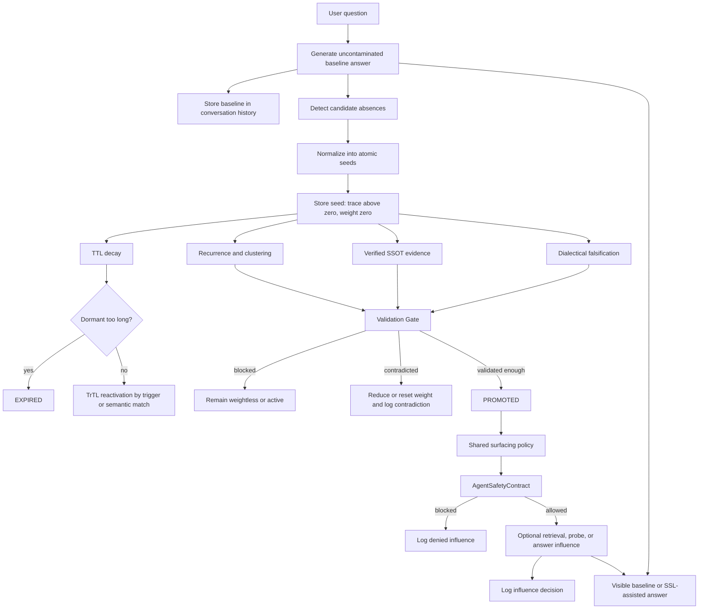

# Shadowseed Pro

<p align="center">
  <strong>An auditable research implementation of Shadow Seed Learning.</strong>
</p>

<p align="center">
  <a href="https://github.com/E-AI-MODEL/shadowseed-pro/actions/workflows/ci.yml">
    
  </a>
  
  
  
  
  
</p>

<p align="center">
  <code>trace &gt; 0</code> means a candidate is remembered. <code>weight = 0</code> means it cannot steer.
</p>

Shadow Seed Learning, or SSL, treats a possible omission in a model answer as a **candidate for investigation**, not as hidden truth. The candidate is stored as an atomic shadow seed. It may recur, decay, reactivate, collect evidence, face contradiction, and be promoted. It may influence retrieval or an answer only after a logged Validation Gate decision and a second point-of-use safety check.

This repository contains the runtime, tests, benchmark harnesses, research instruments, evidence artifacts, and historical material used to examine that mechanism.

> [!IMPORTANT]
> **Shadowseed Pro is research-ready, not production-ready.**
>
> The repository implements and tests the main SSL mechanics. It does not establish general answer-quality improvement, universal hallucination detection, a general neural signal for missing context, or safe deployment in high-impact settings.

> [!NOTE]
> Active runtime code and current documentation are in English. Historical Dutch source material is retained under [`archive/`](archive/) for provenance and must not be treated as current runtime authority.

---

## Choose your route

| I want to... | Start here |
|---|---|
| Understand SSL without reading code | [The idea in plain language](#the-idea-in-plain-language) |
| See the rule that protects answers from unverified seeds | [The invariant](#the-invariant) |
| See the full runtime path | [How a seed moves through the system](#how-a-seed-moves-through-the-system) |
| Find the code behind each claim | [What the code enforces](#what-the-code-enforces) |
| Understand the H-Neurons connection | [H-Neurons: code influence and separate experiment](#h-neurons-code-influence-and-separate-experiment) |
| Review the scientific basis | [Scientific basis and exact claim boundaries](#scientific-basis-and-exact-claim-boundaries) |
| Install and run the package | [Quick start](#quick-start) |
| Run the H-Neurons-style activation probe | [Activation-probe commands](#activation-probe-commands) |
| Navigate the repository | [Repository map](#repository-map) |
| Understand what is canonical, legacy, or archived | [Repository authority](#repository-authority) |
| Check the evidence level of a result | [Evidence hierarchy](#evidence-hierarchy) |
| See what is proven and what remains open | [Research status](#research-status) |

---

# The idea in plain language

A model answer can be fluent and still leave out a relation, boundary, dependency, assumption, alternative explanation, or relevant contradiction.

SSL allows a detector to say:

> Something specific may be missing here.

That statement is not accepted as fact. It becomes a small, testable seed with no authority over the answer. The system can remember it, look for recurrence, compare it with trusted material, try to falsify it, and record every decision. A seed gains influence only after it passes the Validation Gate.

A useful analogy is a research notebook:

- an observation can be recorded before it is believed;
- repeated observations can justify closer investigation;
- evidence and contradiction must remain visible;
- a hypothesis does not become a result because it sounds plausible;
- a rejected hypothesis must lose influence;
- the route from observation to decision must be reconstructable.

SSL applies that discipline to candidate absences in model output.

## What a seed is

A seed is one atomic candidate absence.

Good seed:

```text
The answer does not state whether the reported association is causal.
```

Too broad:

```text
The answer needs more context, nuance, limitations, causes, consequences, and alternatives.
```

The first can be checked. The second hides several different claims inside one vague instruction.

## What SSL is not

SSL is not:

- a claim that model intuitions are facts;
- a generic long-term memory that silently rewrites future answers;
- a replacement for retrieval, source verification, or human review;
- a universal hallucination detector;
- a claim that an internal neuron signal has been established;
- a production safety certification.

---

# The invariant

The central rule is intentionally simple:

```text
trace  > 0   means the seed is present in shadow memory
weight = 0   means the seed has no steering authority
```

`trace` and `weight` are separate state variables with separate meanings.

| Concept | Meaning | What it cannot do |
|---|---|---|
| `trace` | Presence, recurrence, decay, and reactivation | Grant influence by itself |
| `weight` | Bounded steering authority after validation | Rise because a detector sounds convincing |
| seed | A candidate absence | Count as evidence for itself |
| evidence | External or verified support | Bypass the Validation Gate |
| contradiction | A reason to block, reduce, or reset influence | Be hidden from the audit trail |
| promotion | Permission to be considered | Force inclusion in an answer |
| surfacing | Contextual selection at use time | Override the safety contract |

Three consequences follow:

1. **Detection is not validation.** A detector may propose a seed, but the seed starts at `weight = 0.0`.
2. **Promotion is not mandatory use.** A promoted seed must still fit the current question and pass point-of-use checks.
3. **A signal is not a verdict.** This applies to model-generated gaps, retrieval hits, probe outcomes, and neuron activations.

---

# How a seed moves through the system



## Baseline isolation

The live chat generates a baseline answer without seed influence. That baseline is:

- inspected for new gaps;
- stored in conversation history;
- kept separate from the SSL-assisted visible answer.

This limits two feedback loops:

- **gap starvation:** an SSL-assisted answer fills an omission and prevents the detector from seeing the original absence;
- **history contamination:** an earlier SSL addition becomes indistinguishable from the model's original answer in later turns.

The implementation is in [`src/shadowseed/chat.py`](src/shadowseed/chat.py) and the shared prompt and surfacing logic is in [`src/shadowseed/surfacing.py`](src/shadowseed/surfacing.py).

## Lifecycle

```text
NEW -> ACTIVE -> DECAYING -> DORMANT -> EXPIRED
                         \-> PROMOTED
```

`EXPIRED` is terminal. A dormant seed may return through TrTL recognition, but an expired seed is not silently resurrected.

---

# What the code enforces

The table below connects repository claims to current code. It is not a list of aspirations.

| Property | Runtime implementation | Tests or evaluation |
|---|---|---|
| Atomic candidate seeds | [`manager.py`](src/shadowseed/manager.py), [`seed_normalization.py`](src/shadowseed/seed_normalization.py) | [`test_atomic_seed_rules.py`](tests/test_atomic_seed_rules.py), [`test_seed_normalization.py`](tests/test_seed_normalization.py) |
| New seeds start weightless | [`ShadowSeed.weight = 0.0`](src/shadowseed/manager.py) | [`test_manager_smoke.py`](tests/test_manager_smoke.py), [`test_manager_alignment.py`](tests/test_manager_alignment.py) |
| Trace is separate from influence | [`manager.py`](src/shadowseed/manager.py) | [`test_manager_alignment.py`](tests/test_manager_alignment.py), [`test_lifecycle_ttl.py`](tests/test_lifecycle_ttl.py) |
| TTL decay and terminal expiry | [`SSLManager.decay_traces`](src/shadowseed/manager.py) | [`test_lifecycle_ttl.py`](tests/test_lifecycle_ttl.py), [`test_bad_seed_dies_out.py`](tests/test_bad_seed_dies_out.py) |
| TrTL reactivation | [`SSLManager.reactivate_by_text`](src/shadowseed/manager.py) | [`test_lifecycle_ttl.py`](tests/test_lifecycle_ttl.py) |
| Evidence and recurrence pass through a Gate | [`SSLManager.run_validation_gate_detailed`](src/shadowseed/manager.py) | [`test_manager_alignment.py`](tests/test_manager_alignment.py), [`test_adversarial_gate_benchmark.py`](tests/test_adversarial_gate_benchmark.py) |
| Contradiction can reset influence | [`SSLManager._apply_contradiction`](src/shadowseed/manager.py) | [`test_ssot_falsification.py`](tests/test_ssot_falsification.py), [`test_dialectic_falsification.py`](tests/test_dialectic_falsification.py) |
| Generated output is not trusted evidence | [`ssot.py`](src/shadowseed/ssot.py), [`agent_contract.py`](src/shadowseed_agent/agent_contract.py) | [`test_ssot_manager.py`](tests/test_ssot_manager.py), [`test_agent_safety_contract.py`](tests/test_agent_safety_contract.py) |
| Promotion is rechecked at use time | [`AgentSafetyContract`](src/shadowseed_agent/agent_contract.py) | [`test_agent_safety_contract.py`](tests/test_agent_safety_contract.py) |
| Live chat and benchmarks share surfacing logic | [`surfacing.py`](src/shadowseed/surfacing.py) | [`test_surfacing.py`](tests/test_surfacing.py), [`test_ssl_session_suite.py`](tests/test_ssl_session_suite.py) |
| Baseline history remains uncontaminated | [`chat.py`](src/shadowseed/chat.py) | [`test_shadow_chat.py`](tests/test_shadow_chat.py) |
| Retrieval probes report presence without declaring truth | [`retrieval_probe.py`](src/shadowseed/retrieval_probe.py), [`chat.py`](src/shadowseed/chat.py) | [`test_seed_retrieval_probe.py`](tests/test_seed_retrieval_probe.py), [`test_ssl_vs_rag_benchmark.py`](tests/test_ssl_vs_rag_benchmark.py) |
| Every gate and influence attempt is auditable | [`manager.py`](src/shadowseed/manager.py), [`audit_policy.py`](src/shadowseed_agent/audit_policy.py) | [`test_agent_safety_contract.py`](tests/test_agent_safety_contract.py), [`test_shadow_chat.py`](tests/test_shadow_chat.py) |

## Seed origin metadata

[`SeedOrigin`](src/shadowseed/manager.py) records why a detector proposed a candidate, including its candidate type, detection basis, and optional context reference.

This metadata is audit-only. It does not count as evidence and cannot raise weight. A persuasive rationale still leaves a new seed at `weight = 0.0`.

## Trusted evidence is stored separately

[`SSOTManager`](src/shadowseed/ssot.py) keeps trusted document chunks separate from uncertain seeds.

- verified chunks may supply external evidence to the Gate;
- LLM-generated claims enter as unverified proposals;
- proposed chunks remain searchable but cannot validate seeds until explicitly verified;
- the SSOT never assigns weight directly.

## Dialectical falsification

[`dialectic_falsification.py`](src/shadowseed/benchmark/dialectic_falsification.py) asks an adversarial reviewer to argue a candidate away against its source text.

- `WEERLEGD` routes through a Gate contradiction and removes influence;
- `HOUDT_STAND` can provide bounded probe feedback but cannot promote a seed;
- `ONBESLIST` is neutral;
- ambiguous model output fails safe to `ONBESLIST`.

---

# H-Neurons: code influence and separate experiment

H-Neurons appears in this repository in **two different roles**. They must not be merged into one claim.

## Role 1: a methodological influence on the activation-probe code

Gao et al. introduced H-Neurons as a sparse subset of feed-forward neurons whose activations can predict hallucination occurrence in large instruction-tuned models. Their public pipeline uses neuron-level activation extraction and sparse logistic regression. Their intervention example acts on the input to the MLP down projection.

Shadowseed Pro adapts parts of that **measurement pattern** for a different research question:

> Can a small model's internal activations linearly separate external dialectical verdicts about whether a candidate absence survives falsification?

The corresponding implementation is [`src/shadowseed/benchmark/activation_probe.py`](src/shadowseed/benchmark/activation_probe.py).

| H-Neurons-inspired element | Shadowseed implementation |
|---|---|
| Per-neuron read point | `HFActivationModel(read_location="neuron")` captures the input to `mlp.down_proj` or `mlp.c_proj`, after the nonlinearity and before projection back to the residual stream |
| Sparse linear detector | NumPy L1 logistic regression using deterministic ISTA/FISTA |
| Sparse candidate dimensions | Non-zero classifier weights are reported as `candidate_neurons`, not established causal neurons |
| Generalization check | Leave-one-out cross-validation reports balanced accuracy |
| Chance control | Exact or Monte Carlo label-shuffle permutation tests |
| Focused activation extraction | Statement-token pooling can isolate the candidate claim from the surrounding source and prompt |
| Reproducibility fields | Model revision, load dtype, verdict source, label coverage, and permutation count are written to the result artifact |
| Separation of label source and probed model | External dialectical verdicts can label activations from a different small Hugging Face model |

The CLI exposes these choices in [`src/shadowseed/cli.py`](src/shadowseed/cli.py):

```text
shadowseed run-activation-probe
  --read-location neuron
  --sparse-permutations 500
  --model-revision <immutable revision>
  --require-verdict-coverage
```

The method is guarded by [`tests/test_activation_probe.py`](tests/test_activation_probe.py). Tests cover planted sparse dimensions, random-noise controls, permutation floors, deterministic fitting, focused pooling, external verdict coverage, and the explicit rule that the probe may not import `SSLManager` or call the Validation Gate.

### Exact difference from the H-Neurons paper

Shadowseed Pro does not reproduce the H-Neurons claim.

- Gao et al. study hallucination-associated neurons in models represented in their public examples at roughly 24B, 27B, and 70B parameters.
- Shadowseed's experiment studies dialectical verdict separation in models up to 0.5B parameters.
- H-Neurons predicts hallucination occurrence. Shadowseed probes whether candidate-gap verdict classes are linearly decodable.
- H-Neurons includes causal interventions. Shadowseed's probe is observational and never changes generation or seed state.
- A `candidate_neuron` in a Shadowseed artifact is a sparse classifier feature, not a proven H-Neuron.

## Role 2: a separate bounded research track

The repository also contains a small, separate H-Neurons-style investigation under the Layer G research track.

Key artifacts:

- [`round_032/RESULTS.md`](benchmarks/open_review/rounds/round_032/RESULTS.md)
- [`round_033/RESULTS.md`](benchmarks/open_review/rounds/round_033/RESULTS.md)
- [`docs/research/h-neurons-conclusion.md`](docs/research/h-neurons-conclusion.md)
- historical workflow provenance: [`archive/source-workflows/activation-probe-real-verdict.yml`](archive/source-workflows/activation-probe-real-verdict.yml)

### What was tested

The track used:

- a multilingual Qwen2.5 0.5B model;
- neuron-level `down_proj` input activations;
- externally generated dialectical verdict labels;
- centroid separation;
- sparse L1 logistic regression;
- leave-one-out cross-validation;
- label-shuffle permutation controls;
- multiple-comparison correction;
- a preregistered replication on a new case set;
- pinned numerical dependencies for repeatability.

### What was found

Round 032 produced a tempting candidate signal, but it did not pass the corrected significance threshold. Round 033 tested fixed layers and detectors on a new case set. None of the four preregistered tests passed, and the sparse classifier returned to chance-level performance on the preregistered layers.

The defensible conclusion is a bounded null result:

- no reproducible linearly decodable dialectical-verdict signal was established in the evaluated models up to 0.5B parameters;
- the result does not exclude nonlinear representations, other activation sites, different tasks, larger datasets, or larger models;
- the result does not weaken the external runtime mechanics in layers A-F;
- the runtime must not depend on the tested internal signal.

### How the result changed the architecture

The experiment supports a conservative boundary already enforced in code:

```text
internal signal != evidence != verdict != permission to influence
```

The production-facing path remains external and auditable:

1. store the seed weightless;
2. require recurrence and verified evidence;
3. test contradiction;
4. log the Validation Gate decision;
5. recheck promotion at the point of use;
6. record every attempted influence.

This is why the activation probe is located in the benchmark package and is forbidden from touching seed state.

---

# Scientific basis and exact claim boundaries

Shadow Seed Learning is a research architecture, not a direct implementation of one paper. The literature below supports specific design choices or supplies relevant counter-evidence. The final column states what the repository does **not** claim.

| Research | Finding relevant to this repository | Where it appears in code | Boundary |
|---|---|---|---|
| Gao et al. (2025), **H-Neurons** | Sparse FFN activations can carry predictive hallucination signals; sparse classifiers and the down-projection input are useful research instruments | [`activation_probe.py`](src/shadowseed/benchmark/activation_probe.py), `read_location="neuron"`, sparse L1 probe | Shadowseed does not claim to have found H-Neurons or to reproduce results from 24B-70B models |
| Vaddi & Vaddi (2026), **Do Hallucination Neurons Generalize?** | A recent preprint reports a large drop from within-domain to cross-domain transfer across 3B-8B models | Domain-specific evaluation, transfer case sets, and refusal to treat one internal signal as universal | This is a preprint, and it does not establish that all neuron signals fail to transfer |
| Alansari et al. (2026), **CrossHallu** | Another recent preprint finds that transfer can occur for many models, while depending on model, language alignment, and dataset | The README and research status treat generalization as an empirical question, not a settled property | The emerging literature is mixed; Shadowseed makes no universal cross-domain or cross-lingual claim |
| Farquhar et al. (2024), **Semantic entropy** | Uncertainty over meanings can detect a class of confabulations and support selective handling | Candidate gaps are stored as uncertain, powerless signals until checked | Shadowseed does not implement semantic entropy and does not equate a gap signal with hallucination probability |
| Yao et al. (2025), **SeaKR** | Internal self-aware uncertainty can trigger adaptive retrieval in a trained research system | Promoted seeds can drive optional retrieval probes and are filtered by relevance at use time | Shadowseed does not use its failed activation probe as a runtime retrieval trigger |
| Asai et al. (2024), **Self-RAG** | Retrieval can be selective and paired with explicit critique rather than invoked indiscriminately | Shared surfacing policy, optional retrieval probes, and dialectical review | Shadowseed is not trained with reflection tokens and is not a Self-RAG reproduction |
| Soudani et al. (2025), **Uncertainty estimation in RAG** | Existing uncertainty estimators do not fully satisfy proposed correctness axioms in RAG | Uncertainty remains separate from verified evidence, contradiction, and gate permission | The Gate is an inspectable policy mechanism, not proof that response correctness is calibrated |
| Ge et al. (2025), **Conflicting evidence in RAG fact-checking** | Conflicting evidence and source credibility can materially reduce RAG reliability | Separate SSOT store, trust status, verified proposals, contradiction handling | Shadowseed does not yet implement a complete media-credibility model or source-ranking science |

## Scientific position of the repository

The code follows five research-facing principles:

### 1. Treat uncertainty as a reason to inspect, not a reason to believe

A candidate absence may be useful even when it is wrong. The safe first operation is to preserve it without influence.

### 2. Separate model-generated proposals from trusted evidence

Generated text can suggest what to investigate. It cannot verify itself.

### 3. Make falsification a first-class operation

A candidate should face an active attempt to show that it is redundant, already covered, unsupported, or contradicted.

### 4. Require selection at the moment of use

Even a promoted seed may be irrelevant to the current question. Surfacing is based on current semantic fit, conversation timing, top-k limits, and resurface damping.

### 5. Prefer bounded null results over attractive overclaims

The H-Neurons-style track retained its negative replication and used it to tighten the runtime claim boundary.

## Older conceptual antecedents

The mechanism also relates to older work on epistemic uncertainty, active learning, and computational curiosity. Those lines help explain why an uncertain region may be worth probing. They do not by themselves validate this implementation.

---

# Quick start

## Requirements

- Python 3.10 or newer
- Git
- optional local or hosted model access for non-fixture runs

## Install and test

```bash
git clone https://github.com/E-AI-MODEL/shadowseed-pro.git
cd shadowseed-pro
python -m pip install --upgrade pip
pip install -e ".[test]"
python -m pytest -q
python -m ruff check .
```

## Run the deterministic chat demo

```bash
shadowseed chat --backend fixture --show-shadow
```

The fixture backend checks pipeline mechanics. It is not evidence of real-model quality.

## Run the main regression and benchmark commands

```bash
shadowseed run-gap-suite
shadowseed run-false-positive-suite
shadowseed run-benefit-suite
shadowseed run-model-benefit-suite --backend fixture
shadowseed run-adversarial-gate-benchmark
shadowseed run-probe-utility-benchmark
shadowseed run-probe-feedback-behavior-suite
shadowseed analyze-results
```

## Optional dependencies

```bash
pip install -e ".[models]"          # Hugging Face, Sentence Transformers, Torch
pip install -e ".[openai]"          # hosted OpenAI adapter
pip install -e ".[vector]"          # FAISS and Chroma
pip install -e ".[paper]"           # PDF paper pipeline
pip install -e ".[dev]"             # all development extras
```

API keys must be supplied through environment variables. Never commit keys to source, fixture files, or workflow inputs.

---

# Activation-probe commands

## Mechanics-only smoke run

```bash
shadowseed run-activation-probe \
  --backend fake \
  --input src/shadowseed/data/dialectic_falsification_fixture.json \
  --read-location neuron \
  --sparse-permutations 99 \
  --output results/activation_probe_fake.json
```

This run verifies the hooks-to-vectors-to-statistics pipeline. The fake backend contains no neural signal and supplies no scientific evidence about model internals.

## Real Hugging Face probe

```bash
pip install -e ".[test,models]"

shadowseed run-activation-probe \
  --backend hf \
  --model-id Qwen/Qwen2.5-0.5B \
  --input src/shadowseed/data/dialectic_falsification_transfer_v3.json \
  --verdicts benchmarks/open_review/rounds/round_033/verdicts_run_29490380118.json \
  --pooling statement \
  --read-location neuron \
  --sparse-permutations 500 \
  --model-revision <immutable-hugging-face-commit-sha> \
  --require-verdict-coverage \
  --dtype float32 \
  --output results/activation_probe.json
```

A real probe can require substantial memory and time. Reproducible comparison requires a fixed model revision, fixed dependencies, fixed labels, fixed case data, and an analysis plan written before looking at the strongest layer.

## Generate fresh external dialectical labels

```bash
shadowseed run-dialectic-falsification \
  --backend openai \
  --model-id <model-id> \
  --input src/shadowseed/data/dialectic_falsification_transfer_v3.json \
  --output results/dialectic_verdicts.json
```

Then pass `results/dialectic_verdicts.json` to `run-activation-probe --verdicts`.

Fresh model labels are not bit-reproducible by default. Preserve the verdict artifact and record the model identifier and date.

---

# Architecture

## Runtime modules

| Module | Responsibility |
|---|---|
| [`shadowseed.manager`](src/shadowseed/manager.py) | Seed model, trace/weight separation, lifecycle, TTL, TrTL, Validation Gate, contradiction, feedback logs |
| [`shadowseed.seed_normalization`](src/shadowseed/seed_normalization.py) | Candidate cleanup and atomic splitting |
| [`shadowseed.surfacing`](src/shadowseed/surfacing.py) | Shared relevance thresholds, early-turn discipline, top-k selection, resurface damping |
| [`shadowseed.chat`](src/shadowseed/chat.py) | Live sidecar session, baseline isolation, recurrence, point-of-use filtering, audit trail |
| [`shadowseed.detection`](src/shadowseed/detection/) | Open-set and model-backed candidate generation |
| [`shadowseed.adapters`](src/shadowseed/adapters/) | Model, embedding, Ollama, and OpenAI adapters |
| [`shadowseed.ssot`](src/shadowseed/ssot.py) | Trusted evidence store and explicit verification boundary |
| [`shadowseed.retrieval_probe`](src/shadowseed/retrieval_probe.py) | Seed-based retrieval probes that report presence without declaring truth |
| [`shadowseed.recurrence_clustering`](src/shadowseed/recurrence_clustering.py) | Paraphrase-aware recurrence clustering |
| [`shadowseed.vectorstore`](src/shadowseed/vectorstore/) | Memory, FAISS, and Chroma storage adapters |
| [`shadowseed_agent.agent_contract`](src/shadowseed_agent/agent_contract.py) | Zero-trust influence decision at the agent boundary |
| [`shadowseed_agent.audit_policy`](src/shadowseed_agent/audit_policy.py) | Replay checks for weightless or otherwise forbidden influence |

## Evaluation and research modules

| Module | Responsibility |
|---|---|
| [`shadowseed.benchmark.activation_probe`](src/shadowseed/benchmark/activation_probe.py) | H-Neurons-style activation extraction and sparse statistical probe |
| [`shadowseed.benchmark.dialectic_falsification`](src/shadowseed/benchmark/dialectic_falsification.py) | Active attempt to refute promoted candidates against source text |
| [`shadowseed.benchmark.adversarial_gate_benchmark`](src/shadowseed/benchmark/adversarial_gate_benchmark.py) | Comparison of the current Gate with weaker promotion rules |
| [`shadowseed.benchmark.ssl_session_suite`](src/shadowseed/benchmark/ssl_session_suite.py) | Multi-turn runtime evaluation through the real manager and Gate |
| [`shadowseed.benchmark.ssl_vs_rag_benchmark`](src/shadowseed/benchmark/ssl_vs_rag_benchmark.py) | Gap-query retrieval probe versus ordinary question-query RAG |
| [`shadowseed.analysis`](src/shadowseed/analysis/) | Result analysis and canonical artifact precedence |

---

# Repository map

```text
shadowseed-pro/
├── README.md                       repository front page
├── pyproject.toml                  packaging and tool configuration
├── repository-authority.yaml       machine-readable authority map
├── src/
│   ├── shadowseed/                 canonical runtime package
│   │   ├── adapters/               model and service adapters
│   │   ├── analysis/               result analysis
│   │   ├── benchmark/              evaluation and research implementations
│   │   ├── data/                   packaged fixtures and curated inputs
│   │   ├── detection/              candidate detectors
│   │   └── vectorstore/            memory, FAISS, and Chroma backends
│   └── shadowseed_agent/           point-of-use contract and audit policy
├── tests/                           contract, unit, integration, and regression tests
├── benchmarks/                      benchmark definitions and reviewed rounds
│   ├── open_review/rounds/          committed research and review artifacts
│   └── results/                     generated benchmark snapshots
├── docs/
│   ├── architecture/               canonical architecture specification
│   ├── research/                   current research conclusions and limits
│   ├── usage/                      current usage documentation
│   └── migration/                  rebuild and provenance records
├── data/                            source papers and evidence material, not packaged
├── experiments/                     exploratory runners, not supported runtime
├── scripts/                         research and review utilities
├── results/                         local and generated analysis output
└── archive/                         frozen historical source material
```

---

# Repository authority

The repository distinguishes implementation, evidence, compatibility, and history. The machine-readable source is [`repository-authority.yaml`](repository-authority.yaml). The narrative guide is [`docs/architecture/repository-structure.md`](docs/architecture/repository-structure.md).

| Authority class | Meaning |
|---|---|
| `CANONICAL_SPEC` | Current architecture, packaging, or repository rules |
| `RUNTIME_IMPLEMENTATION` | Code shipped in the installed package |
| `CONTRACT_TEST` | Tests that pin runtime or compatibility behavior |
| `EVALUATION_IMPLEMENTATION` | Benchmarks, research instruments, and evaluation utilities |
| `EVIDENCE_ARTIFACT` | Curated or generated result material |
| `COMPATIBILITY_ONLY` | Legacy import facade with no independent logic |
| `HISTORICAL_REFERENCE` | Superseded material kept for provenance |
| `ARCHIVE` | Frozen source material excluded from the package |

Rules for reading the repository:

- canonical runtime lives under `src/shadowseed/` and `src/shadowseed_agent/`;
- tests are evidence that a behavior is checked, not proof of real-world performance;
- a benchmark runner proves the evaluation route exists, not that a positive result was obtained;
- result artifacts must be read with their case set, backend, labels, thresholds, and review method;
- archive material may explain project history but cannot override current code or architecture docs;
- fixture outputs demonstrate harness behavior only.

---

# Evidence hierarchy

Use this order when checking a repository claim:

1. **Runtime code**: the behavior is implemented.
2. **Contract and regression tests**: the behavior is exercised and pinned.
3. **Benchmark implementation**: a controlled evaluation route exists.
4. **CI or recorded execution**: the route ran in a stated environment.
5. **Result artifact**: outcomes are available with inputs and settings.
6. **Independent or human review**: judgments were checked outside the generating path.
7. **Replication or transfer**: the result survives new data, domains, models, or reviewers.
8. **Documentation claim**: a statement explains the system but is not evidence by itself.

A strong README claim should point downward through this stack, not stop at prose.

## Fixture versus real-model evidence

| Evidence type | What it can show | What it cannot show |
|---|---|---|
| deterministic fixture | command wiring, schemas, state transitions, logging, failure handling | real detector quality or answer benefit |
| synthetic planted signal | whether a statistical instrument can recover a known feature | whether the feature exists in a real model |
| one real-model run | behavior on that model, case set, prompt, and environment | generalization |
| reviewed benchmark | performance under a stated review protocol | production safety |
| preregistered replication | whether a fixed claim survives a new sample | universal validity |

---

# Research status

## Implemented and testable

- atomic seed intake and normalization;
- separate trace and weight state;
- weightless-by-default candidates;
- TTL decay, dormancy, TrTL reactivation, and terminal expiry;
- Validation Gate decisions with recurrence, evidence, and contradiction flags;
- bounded probe feedback and demotion;
- external SSOT evidence separated from generated proposals;
- shared live-chat and benchmark surfacing policy;
- point-of-use AgentSafetyContract;
- baseline isolation in the live chat;
- retrieval probes and vector-store adapters;
- audit logs for seed, gate, feedback, and influence events;
- deterministic fixtures plus optional Hugging Face, Ollama, OpenAI, FAISS, and Chroma routes;
- H-Neurons-style activation-probe instrument with permutation controls;
- committed null-result and replication artifacts for the small-model activation track.

## Not established

- general answer-quality improvement across open-ended tasks;
- a universal definition or detector for meaningful absence;
- a general internal neural representation of missing context;
- cross-domain or cross-lingual generalization of seed quality;
- reliable value from every promoted seed;
- calibration between seed weight and factual correctness;
- safety against all prompt-injection, evidence-poisoning, or seed-spam attacks;
- production readiness.

## Work still required for production use

- durable seed, evidence, gate, and influence storage;
- schema migrations and deterministic replay across versions;
- versioned SSOT policies and source-governance rules;
- privacy, retention, deletion, and access controls for seed and evidence text;
- monitoring for false promotion, stale seeds, contradiction rates, and surfacing drift;
- rate limits and adversarial seed-spam controls;
- rollback for promoted influence;
- explicit operator approval for high-impact actions;
- failure isolation for model, embedding, vector-store, and retrieval backends;
- real-world evaluations with independent review;
- a selected software license.

---

# Reproducibility rules

Research runs should record:

- repository commit;
- Python and operating-system version;
- package versions, especially NumPy, Torch, and Transformers;
- model ID and immutable model revision;
- dtype and device;
- input case file and its hash;
- prompt variant and pooling location;
- external verdict artifact and coverage;
- random seeds;
- number of permutations;
- multiple-comparison correction;
- preregistered layers or hypotheses;
- output artifact hash.

Do not select the strongest layer and then present its uncorrected p-value as confirmation. Discovery and confirmation require separate data or a preregistered test.

---

# Documentation

- [Architecture overview](docs/architecture/overview.md)
- [Lifecycle and Validation Gate](docs/architecture/lifecycle-and-gate.md)
- [Repository structure](docs/architecture/repository-structure.md)
- [Compatibility policy](docs/architecture/compatibility-policy.md)
- [CLI usage](docs/usage/cli.md)
- [Research status](docs/research/status.md)
- [H-Neurons conclusion](docs/research/h-neurons-conclusion.md)
- [Migration audit](docs/migration/source-audit.md)
- [Reuse decisions](docs/migration/reuse-decisions.md)
- [Authority map](repository-authority.yaml)

---

# References

## Recent research

- Gao, C., Chen, H., Xiao, C., Chen, Z., Liu, Z., & Sun, M. (2025). **H-Neurons: On the Existence, Impact, and Origin of Hallucination-Associated Neurons in LLMs.** [arXiv:2512.01797](https://arxiv.org/abs/2512.01797). [Official implementation](https://github.com/thunlp/H-Neurons).
- Vaddi, S., & Vaddi, P. (2026). **Do Hallucination Neurons Generalize? Evidence from Cross-Domain Transfer in LLMs.** Preprint. [arXiv:2604.19765](https://arxiv.org/abs/2604.19765).
- Alansari, A., Alkhorasani, M., & Luqman, H. (2026). **CrossHallu: Do Hallucination Signals Generalize Across Languages and Domains in Large Language Model's Internals?** Preprint. [arXiv:2607.04029](https://arxiv.org/abs/2607.04029).
- Farquhar, S., Kossen, J., Kuhn, L., & Gal, Y. (2024). **Detecting hallucinations in large language models using semantic entropy.** *Nature, 630*, 625-630. [DOI: 10.1038/s41586-024-07421-0](https://doi.org/10.1038/s41586-024-07421-0).
- Yao, Z., Qi, W., Pan, L., Cao, S., Hu, L., Liu, W., Hou, L., & Li, J. (2025). **SeaKR: Self-aware Knowledge Retrieval for Adaptive Retrieval Augmented Generation.** *ACL 2025*, 27022-27043. [DOI: 10.18653/v1/2025.acl-long.1312](https://doi.org/10.18653/v1/2025.acl-long.1312).
- Soudani, H., Kanoulas, E., & Hasibi, F. (2025). **Why Uncertainty Estimation Methods Fall Short in RAG: An Axiomatic Analysis.** *Findings of ACL 2025*, 16596-16616. [DOI: 10.18653/v1/2025.findings-acl.852](https://doi.org/10.18653/v1/2025.findings-acl.852).
- Ge, Z., Wu, Y., Chin, D. W. K., Lee, R. K.-W., & Cao, R. (2025). **Resolving Conflicting Evidence in Automated Fact-Checking: A Study on Retrieval-Augmented LLMs.** [arXiv:2505.17762](https://arxiv.org/abs/2505.17762).
- Asai, A., Wu, Z., Wang, Y., Sil, A., & Hajishirzi, H. (2024). **Self-RAG: Learning to Retrieve, Generate, and Critique through Self-Reflection.** *ICLR 2024 oral*. [OpenReview](https://openreview.net/forum?id=hSyW5go0v8).

## Conceptual antecedents

- Kendall, A., & Gal, Y. (2017). **What Uncertainties Do We Need in Bayesian Deep Learning for Computer Vision?** *NeurIPS 2017*.
- Schmidhuber, J. (2010). **Formal Theory of Creativity, Fun, and Intrinsic Motivation.** *IEEE Transactions on Autonomous Mental Development, 2*(3), 230-247.
- Settles, B. (2009). **Active Learning Literature Survey.** University of Wisconsin-Madison.

These references provide context and testable precedents. They do not collectively prove Shadow Seed Learning.

---

# License

No software license was present in the source material used for the repository rebuild. A license must be selected before third-party reuse, redistribution, or integration can be treated as permitted.
