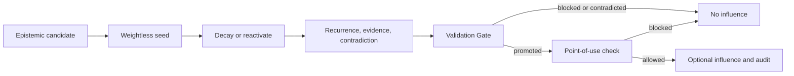
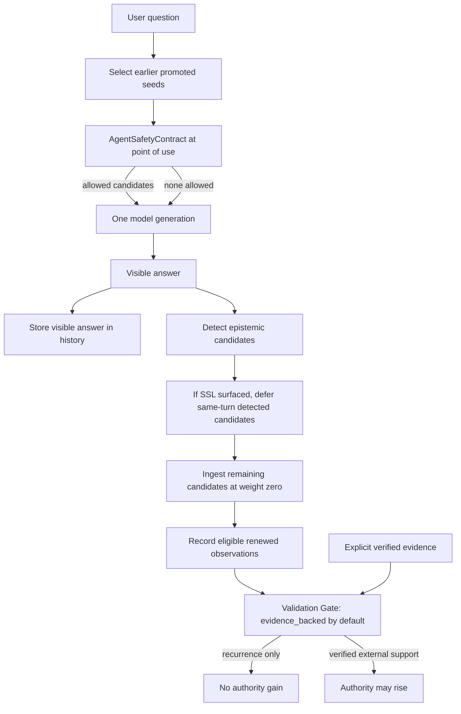

# Shadowseed Pro

<p align="center">
  <strong>An auditable research implementation of Shadow Seed Learning.</strong>
</p>

<p align="center">
  <a href="https://github.com/E-AI-MODEL/shadowseed-pro/actions/workflows/ci.yml">
    
  </a>
  
  
  
  
  
</p>

<p align="center">
  <code>trace &gt; 0</code> means remembered. <code>weight = 0</code> means no steering authority.
</p>

Shadow Seed Learning, or SSL, records a possible omission as a **candidate for investigation**, not as hidden truth. A new seed starts powerless, can be tested over time, and may influence retrieval or an answer only after a logged Validation Gate decision and a second point-of-use check.

> [!IMPORTANT]
> **Shadowseed Pro is research-ready, not production-ready.**
>
> Version 0.5.0 adds a downloadable local mass-tester preview. That improves product usability; it does not establish general answer-quality improvement, universal missing-information detection, high-impact deployment safety, or hostile-network production readiness.

> [!CAUTION]
> This repository has **no open-source license**. All rights are reserved. Public visibility is not permission for reuse. See [Rights and temporary licensing position](#rights-and-temporary-licensing-position).

## Research paper

**Shadowseed: Remembering Without Trusting**
*A Validation-Gated Memory Architecture for Language Model Systems*

[Read the paper (PDF)](paper/shadowseed-paper.pdf) · [LaTeX source](paper/main.tex) · [Bibliography](paper/references.bib)

## Start here

| Goal | Start here |
|---|---|
| Download/open the tester | [Tester Workbench](#tester-workbench) |
| Read the research paper | [Paper PDF](paper/shadowseed-paper.pdf) |
| Install for development | [Developer quick start](#developer-quick-start) |
| Understand the idea | [The idea in plain language](#the-idea-in-plain-language) |
| Audit the guarantees | [What the code enforces](#what-the-code-enforces) |
| Review evidence and limits | [Research status](#research-status) |
| Navigate the code and docs | [Architecture](#architecture) |

---

## Tester Workbench

The ordinary 0.5.0 tester path is a local chat application, not a benchmark harness:

```text
download -> extract/open -> choose model -> create chat -> chat with SSL -> optionally compare one message with SSL off
```

The 0.5.0 prerelease publishes self-contained Workbench archives for Windows, macOS and Linux from GitHub Releases. Each archive contains the application and its Python runtime. A normal tester does **not** need Git, a repository checkout, system Python, `pip`, benchmark JSON or an authored baseline answer.

After extraction, open `Shadowseed.exe` on Windows, `Shadowseed.app` on macOS, or the `Shadowseed` executable in the Linux bundle. The launcher initializes the normal local `~/.shadowseed` workspace and opens the chat UI on loopback only. Local Ollama models can be detected automatically.

Model weights are intentionally not bundled. The deterministic fixture works immediately for offline mechanics testing; Ollama models remain managed by Ollama; Hugging Face and Sentence Transformers may acquire selected model material on first use; hosted OpenAI use remains explicit and credential-dependent.

A newly created ordinary chat uses the product-oriented `live` runtime and the `evidence_backed` Gate policy. The tester chooses a model and chats normally. For any message they may enable **Compare this message with SSL off**. The Workbench generates a same-model control from the same pre-turn visible history before executing the real live turn. The control is comparison data only: it does not enter candidate detection, recurrence, the Gate, or later conversation history. A textual difference is attributable to SSL only when an authorized seed actually surfaced on the real turn.

Historical `evaluation` sessions, authored baseline fixtures, scenario JSON and benchmark outputs remain research/regression material under **Advanced / research**. They are not product prerequisites.

Each platform bundle must execute a frozen self-test in CI before upload. Release assets include per-platform manifests, consolidated provenance and SHA-256 checksums. Platform-vendor signing/notarization is **not** claimed unless a published asset actually carries it.

See [`docs/workbench/README.md`](docs/workbench/README.md) for the download/open workflow, model behavior, privacy boundaries and release verification. See [`docs/workbench/limitations.md`](docs/workbench/limitations.md) before sharing tester data.

## Developer quick start

The Python package and CLI remain available for development, research and automation.

Requirements: Python 3.10 or newer and Git.

```bash
git clone https://github.com/E-AI-MODEL/shadowseed-pro.git
cd shadowseed-pro
python -m pip install --upgrade pip
pip install -e ".[test,workbench]"
python -m pytest -q
python -m ruff check .
shadowseed-workbench
```

### Deterministic chat demo

```bash
shadowseed chat --backend fixture --show-shadow
```

The fixture backend verifies pipeline mechanics. It is not evidence of real-model quality.

`shadowseed chat` and the `ShadowChatSession` API default to the product-oriented `live` runtime. Live mode produces one visible model answer per turn, stores that same answer in conversation history, and defaults to the `evidence_backed` Gate policy. Detected recurrence remains observable but cannot raise authority on its own. Verified external support enters through `ShadowChatSession.submit_evidence(...)`; the interactive command is `/support <seed_id> <source_ref>`. The caller/operator remains the trust anchor behind a verified external-evidence attestation.

A local semantic developer setup can use:

```bash
shadowseed chat --backend ollama --model-id <model> --embedding-backend sentence-transformers
```

Research A/B behavior remains explicitly available with `--runtime-mode evaluation`; that mode preserves the historical isolated baseline arm.

The multi-turn research session suite can execute the real live loop and calculate same-turn deferral costs:

```bash
shadowseed run-ssl-session \
  --runtime-mode live --live-arms both \
  --backend ollama --model-id <model> \
  --embedding-backend sentence-transformers \
  --output results/ssl_live_session.json
```

This measurement route is research instrumentation, not the ordinary product UI. Fixture and lexical backends are rejected for its live real-model measurement path. See [`docs/usage/cli.md`](docs/usage/cli.md) for command semantics.

<details>
<summary><strong>Common benchmark commands and optional dependencies</strong></summary>

```bash
shadowseed run-gap-suite
shadowseed run-false-positive-suite
shadowseed run-benefit-suite
shadowseed run-model-benefit-suite --backend fixture
shadowseed run-adversarial-gate-benchmark
shadowseed run-probe-utility-benchmark
shadowseed run-probe-feedback-behavior-suite
shadowseed analyze-results
```

```bash
pip install -e ".[models]"          # Hugging Face, Sentence Transformers, Torch
pip install -e ".[openai]"          # hosted OpenAI adapter
pip install -e ".[vector]"          # FAISS and Chroma
pip install -e ".[paper]"           # PDF paper pipeline
pip install -e ".[workbench]"       # local tester Workbench (Gradio 6)
pip install -e ".[dev]"             # all development extras
```

API keys must be supplied through environment variables. Never commit keys to source, fixture files, or workflow inputs.

</details>

---

## The idea in plain language

A fluent answer can still omit a causal boundary, dependency, stakeholder, alternative explanation, contradiction, or necessary question. SSL lets a detector say:

> Something specific may be missing here.

That statement is not accepted as fact. It becomes a small, testable seed with no authority over the answer. The system can remember it, look for recurrence, compare it with trusted material, try to falsify it, and record every decision.

### What a seed is

A seed is one bounded epistemic candidate tied to context. It can represent a gap, doubt, missing relation or boundary, dependency, unstated assumption, alternative hypothesis, contradiction to investigate, or relevant what-if direction. It is not a fact, instruction, evidence item, conclusion, or source of authority.

Atomicity is a **normalization target and tested heuristic**; normalization cannot guarantee that every model-generated proposal is meaningful or perfectly split.

Good seed:

```text
The answer does not state whether the reported association is causal.
```

Too broad:

```text
The answer needs more context, nuance, limitations, causes, consequences, and alternatives.
```

### What SSL is not

SSL is not a claim that model intuitions are facts, a replacement for retrieval or source verification, a universal hallucination detector, or a production safety certification.

## The invariant

```text
trace  > 0   means the seed is present in shadow memory
weight = 0   means the seed has no steering authority
```

| Concept | Meaning | What it cannot do |
|---|---|---|
| `trace` | Presence, recurrence, decay, and reactivation | Grant influence by itself |
| `weight` | Bounded steering authority after validation | Rise because a detector sounds convincing |
| seed | An epistemic candidate | Count as evidence for itself |
| recurrence | Renewed observation in a distinct observation context | Become truth or external evidence |
| evidence | Verified external support with provenance | Bypass the Validation Gate |
| contradiction | A reason to block, reduce, or reset influence | Disappear from the audit trail |
| promotion | Permission to be considered | Force inclusion in an answer |
| surfacing | Contextual selection at use time | Override the point-of-use contract |

Detection is not validation. Promotion is not mandatory use. A signal is not a verdict.

## How a seed moves through the system


```mermaid
flowchart LR
    A[Epistemic candidate] --> B[Weightless seed]
    B --> C[Decay or reactivate]
    C --> D[Recurrence, evidence, contradiction]
    D --> E[Validation Gate]
    E -->|blocked or contradicted| F[No influence]
    E -->|promoted| G[Point-of-use check]
    G -->|blocked| F
    G -->|allowed| H[Optional influence and audit]
```

The conversation runtime has two explicit implementation modes. `live` is product-oriented; `evaluation` preserves the historical isolated baseline arm for research. Seed validation, surfacing, point-of-use authorization and actual influence remain separate concerns.

<details>
<summary><strong>Live runtime, product comparison, evaluation isolation, and lifecycle</strong></summary>

### Live runtime


```mermaid
flowchart TD
    Q[User question] --> U[Select earlier promoted seeds]
    U --> A[AgentSafetyContract at point of use]
    A -->|allowed candidates| M[One model generation]
    A -->|none allowed| M
    M --> V[Visible answer]
    V --> H[Store visible answer in history]
    V --> D[Detect epistemic candidates]
    D --> X[If SSL surfaced, defer same-turn detected candidates]
    X --> N[Ingest remaining candidates at weight zero]
    N --> R[Record eligible renewed observations]
    R --> G[Validation Gate: evidence_backed by default]
    E[Explicit verified evidence] --> G
    G -->|recurrence only| B[No authority gain]
    G -->|verified external support| P[Authority may rise]
```

Live mode avoids a hidden-history split: the answer the user reads is carried into the next turn. If a seed influenced generation, candidates detected in that same answer are deferred because semantic similarity cannot prove causal independence. Recurrence itself is observation, not evidence, and one detector observation context can credit a semantic cluster at most once.

### Product comparison

When **Compare this message with SSL off** is enabled, the Workbench first generates a no-SSL control from the same pre-turn visible history/model configuration. That control is not detected, does not change recurrence or Gate state, and is not appended to conversation history. The actual live turn remains the only state-changing turn.

### Evaluation mode

`--runtime-mode evaluation` preserves the historical research harness with an isolated baseline arm. It exists for controlled benchmark/replay work and is not the default product conversation model.

### Lifecycle

```text
NEW -> ACTIVE -> DECAYING -> DORMANT -> EXPIRED
                         \-> PROMOTED
```

`EXPIRED` is terminal. A dormant seed may return through TrTL recognition, but an expired seed is not silently resurrected.

</details>

---

## What the code enforces

| Enforced property | Canonical implementation | Contract coverage |
|---|---|---|
| New seeds start weightless and authority fields are guarded | [`shadowseed.models`](src/shadowseed/models.py), [`shadowseed.intake`](src/shadowseed/intake.py) | [`test_authority_encapsulation.py`](tests/test_authority_encapsulation.py), [`test_models_extraction.py`](tests/test_models_extraction.py) |
| Trace and authority remain separate across decay and reactivation | [`shadowseed.lifecycle`](src/shadowseed/lifecycle.py) | [`test_lifecycle_ttl.py`](tests/test_lifecycle_ttl.py), [`test_lifecycle_extraction.py`](tests/test_lifecycle_extraction.py) |
| Gate-controlled effects use one typed, policy-bound engine | [`shadowseed.gate.runtime_adapter`](src/shadowseed/gate/runtime_adapter.py) | [`test_gate_path_unification.py`](tests/test_gate_path_unification.py), [`test_gate_boundary_completion.py`](tests/test_gate_boundary_completion.py) |
| Open contradiction records block influence and recovery is explicit | [`shadowseed.contradictions`](src/shadowseed/contradictions.py), [`shadowseed.gate`](src/shadowseed/gate/) | [`test_contradiction_lifecycle.py`](tests/test_contradiction_lifecycle.py), [`test_contradictions_extraction.py`](tests/test_contradictions_extraction.py) |
| Generated or unverified observations do not count as trusted evidence | [`shadowseed.ssot`](src/shadowseed/ssot.py), [`shadowseed.gate`](src/shadowseed/gate/) | [`test_ssot_manager.py`](tests/test_ssot_manager.py), [`test_gate_signal_routing.py`](tests/test_gate_signal_routing.py) |
| Influence requires positive weight, promotion, and a live current-version Gate event | [`AgentSafetyContract.decide_and_record`](src/shadowseed_agent/agent_contract.py) | [`test_point_of_use.py`](tests/test_point_of_use.py), [`test_agent_safety_contract.py`](tests/test_agent_safety_contract.py) |
| Live history stores the visible answer; evaluation mode preserves baseline isolation | [`shadowseed.chat`](src/shadowseed/chat.py) | [`test_live_runtime.py`](tests/test_live_runtime.py), [`test_shadow_chat.py`](tests/test_shadow_chat.py) |
| Gate decisions and influence attempts support strict in-process replay | [`GateEvent`](src/shadowseed/gate/events.py), [`AgentInfluenceRecord`](src/shadowseed_agent/audit_policy.py) | [`test_point_of_use.py`](tests/test_point_of_use.py) |

> **"Non-bypassable" is a public-API property over new authority decisions, not a Python-runtime claim.** Restoration reinstates validated persisted state, and explicitly unsafe test hooks remain callable by arbitrary in-process Python.

### Gate policy profiles

- **`exploratory`**: qualifying recurrence or verified external support may raise authority when no unresolved contradiction exists. This is research/evaluation behavior.
- **`evidence_backed`**: verified external support is required. Recurrence may accompany it but cannot replace it. This is the live product default.
- **`legacy_evidence_required`**: compatibility behavior for the historical boolean API.

Verified external support must carry a non-empty `source_ref`. The underlying source reference is the current authority identity: relabelling one source across signal channels does not create additional independent authority credit. Recurrence remains a separate keyspace and is never converted into external evidence.

### Evidence hierarchy

1. Runtime code
2. Contract and regression tests
3. Benchmark implementation
4. CI or recorded execution
5. Result artifact with inputs and settings
6. Independent or human review
7. Replication or transfer
8. Documentation claim

| Evidence type | What it can show | What it cannot show |
|---|---|---|
| deterministic fixture | command wiring, schemas, state transitions, logging | real detector quality or answer benefit |
| synthetic planted signal | whether an instrument can recover a known feature | whether the feature exists in a real model |
| one real-model run | behavior on that model, data, prompt, and environment | generalization |
| reviewed benchmark | performance under a stated review protocol | production safety |
| preregistered replication | whether a fixed claim survives a new sample | universal validity |

---

## Architecture

`SSLManager` is an orchestration and compatibility facade. Focused modules own the extracted implementation.

| Module | Responsibility |
|---|---|
| [`shadowseed.manager`](src/shadowseed/manager.py) | Runtime configuration, seed registry, audit collections, serialization, guarded authority mutation, and compatibility methods |
| [`shadowseed.models`](src/shadowseed/models.py) | Stable seed, lifecycle, validation-result, constellation, and probe data contracts |
| [`shadowseed.intake`](src/shadowseed/intake.py) | Embedding, normalization, deduplication, and seed creation/update |
| [`shadowseed.lifecycle`](src/shadowseed/lifecycle.py) | TTL decay, dormancy, TrTL reactivation, and terminal expiry |
| [`shadowseed.contradictions`](src/shadowseed/contradictions.py) | Contradiction records, blocking state, formal resolution, sequencing, and migration |
| [`shadowseed.vector_workflows`](src/shadowseed/vector_workflows.py) | Uncertain-region search, external-feedback routing, and constellations |
| [`shadowseed.gate`](src/shadowseed/gate/) | Typed signals, named policies, immutable Gate events, verified logging, and the executable decision engine |
| [`shadowseed_agent`](src/shadowseed_agent/) | Point-of-use eligibility and strict influence replay |

See the [architecture overview](docs/architecture/overview.md), [lifecycle and Gate specification](docs/architecture/lifecycle-and-gate.md), and [repository structure guide](docs/architecture/repository-structure.md).

<details>
<summary><strong>Repository map and authority classes</strong></summary>

```text
shadowseed-pro/
├── README.md                       repository front page
├── CHANGELOG.md                    user-visible structural and behavior changes
├── pyproject.toml                  packaging and tool configuration
├── repository-authority.yaml       machine-readable authority map
├── src/
│   ├── shadowseed/                 canonical runtime package
│   └── shadowseed_agent/           point-of-use contract and audit policy
├── tests/                           contract, unit, integration, and regression tests
├── benchmarks/                      benchmark definitions and reviewed rounds
├── docs/                            architecture, research, usage, and migration docs
├── experiments/                     exploratory runners, not supported runtime
├── scripts/                         research, build, and review utilities
├── results/                         local and generated analysis output
└── archive/                         frozen historical source material
```

| Authority class | Meaning |
|---|---|
| `CANONICAL_SPEC` | Current architecture, packaging, or repository rules |
| `RUNTIME_IMPLEMENTATION` | Code shipped in the installed package |
| `CONTRACT_TEST` | Tests that pin runtime or compatibility behavior |
| `EVALUATION_IMPLEMENTATION` | Benchmarks, research instruments, and evaluation utilities |
| `EVIDENCE_ARTIFACT` | Curated or generated result material |
| `COMPATIBILITY_ONLY` | Legacy import facade with no independent logic |
| `HISTORICAL_REFERENCE` | Superseded material kept for provenance |
| `ARCHIVE` | Frozen source material excluded from the package |

The machine-readable source is [`repository-authority.yaml`](repository-authority.yaml). Archive material may explain history but cannot override current runtime code or canonical architecture documents.

</details>

---

## Research status

The methods/systems manuscript is available in [`paper/`](paper/README.md), with the compiled version at [`paper/shadowseed-paper.pdf`](paper/shadowseed-paper.pdf). Product packaging changes in 0.5.0 do not silently expand the paper's efficacy claims.

### Implemented and testable

- weightless-by-default seed intake;
- separate trace and authority state;
- TTL decay, dormancy, TrTL reactivation, and terminal expiry;
- typed Validation Gate signals and named policies;
- explicit contradiction records and resolution;
- verified external evidence separated from generated proposals;
- a one-generation live loop plus historical evaluation loop;
- same-turn contamination deferral and observation-scoped semantic recurrence;
- point-of-use eligibility with current-version Gate-event linkage;
- chat-first Workbench with automatic live SSL-on/off controls;
- local Ollama model discovery;
- deterministic fixtures plus optional Hugging Face, Ollama and OpenAI routes;
- adversarial, retrieval, payoff, and activation-probe research instruments;
- 0.5.0 standalone build/release contracts for Windows, macOS and Linux.

### Not established

- general answer-quality improvement across open-ended tasks;
- a universal definition or detector for meaningful absence;
- a general internal neural representation of missing context;
- cross-domain or cross-lingual generalization of seed quality;
- reliable value from every promoted seed;
- calibration between seed weight and factual correctness;
- safety against all prompt-injection, evidence-poisoning, or seed-spam attacks;
- hostile-network or high-impact production readiness.

### Work still required for broader production use

Append-only or tamper-evident durable audit persistence, deterministic replay assurance across future versions, access control, explicit retention/deletion operations, monitoring, rollback, backend isolation, rate limits, hostile-network authentication/tenancy, managed secrets, platform vendor signing/notarization, independent security review, broad high-end-model evaluation and real-world independent review remain separate work.

### Appropriate use today

Suitable uses include local product testing, research inspection, mechanism testing, benchmark development, controlled experiments, and discussion of auditable agent memory. Do not treat Shadowseed Pro as a certified safety layer for healthcare, education decisions, employment, finance, law, public administration, or autonomous high-impact action.

---

## Research track and reproducibility

The repository retains the full research track, including AbsenceBench-related tooling, dialectical falsification, H-Neuron-inspired activation probes, negative results, transfer sets and benchmark artifacts. Research evidence remains separate from product packaging.

Key material:

- [`paper/`](paper/README.md)
- [`docs/research/status.md`](docs/research/status.md)
- [`docs/research/h-neurons-conclusion.md`](docs/research/h-neurons-conclusion.md)
- [`benchmarks/open_review/`](benchmarks/open_review/)
- [`benchmarks/results/`](benchmarks/results/)

Research runs should record the repository commit, Python and operating-system versions, package versions, model ID and immutable revision when available, dtype/device, input digest, detector prompt/configuration, embedding model, random seeds, review protocol, and output hashes. Discovery and confirmation require separate data or a preregistered test; selecting the strongest result after inspection is not confirmation.

The runtime must not depend on an unverified internal activation signal:

```text
internal signal != evidence != verdict != permission to influence
```

---

## Documentation

- [Tester Workbench](docs/workbench/README.md)
- [Architecture overview](docs/architecture/overview.md)
- [Lifecycle and Validation Gate](docs/architecture/lifecycle-and-gate.md)
- [Gate contracts](docs/architecture/gate-contracts.md)
- [ADR-005: chat-first product surface](docs/architecture/adr/ADR-005-chat-first-product-surface.md)
- [Repository structure](docs/architecture/repository-structure.md)
- [Compatibility policy](docs/architecture/compatibility-policy.md)
- [CLI usage](docs/usage/cli.md)
- [Research status](docs/research/status.md)
- [H-Neurons conclusion](docs/research/h-neurons-conclusion.md)
- [Authority map](repository-authority.yaml)
- [Changelog](CHANGELOG.md)

> [!NOTE]
> The core runtime code is English, and this is enforced automatically. Product chat follows the current user question's language. Benchmark fixtures retain documented source-language material for compatibility. Historical material under [`archive/`](archive/) is provenance, not current runtime authority.

---

## Rights and temporary licensing position

**Copyright © 2026 H. Visser / E-AI-MODEL. All rights reserved.**

This repository intentionally has no open-source license at present. No general permission is granted to use, copy, modify, redistribute, publish, commercialize, or incorporate the original repository content into another product or service.

Public access is provided for inspection, research discussion, and evaluation. Reuse requires prior written permission from the copyright holder, except where applicable law, GitHub's Terms of Service, or a separate written agreement provides otherwise.

Third-party libraries, papers, datasets, model weights, quoted material, and archived external artifacts remain subject to their own rights and terms.

This is a temporary rights reservation. A later repository update may adopt a different license. Until then, no implied open-source license is granted.

For a legally binding licensing arrangement or commercial use, contact the repository owner and obtain professional legal advice.
