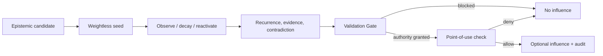

# Shadowseed Pro

<p align="center">
  <strong>Auditable Shadow Seed Learning for research, local testing, and evidence-disciplined evaluation.</strong>
</p>

<p align="center">
  <a href="https://github.com/E-AI-MODEL/shadowseed-pro/actions/workflows/ci.yml"></a>
  
  
  
  
</p>

<p align="center"><code>trace &gt; 0</code> means remembered. <code>weight = 0</code> means no steering authority.</p>

Shadow Seed Learning (SSL) records **bounded epistemic candidates for investigation**, not hidden truth. A candidate may be a suspected gap, doubt, missing relation or boundary, dependency, unstated assumption, alternative hypothesis, contradiction to investigate, or relevant what-if direction. A new seed starts powerless. It may be remembered, recur, be contradicted, receive independently verified support, and only influence a later answer after the configured Validation Gate and a current point-of-use authorization both allow it.

> [!IMPORTANT]
> **Shadowseed Pro is research-ready, not production-ready.** Source version 0.6.0 adds noncommercial research access and an evidence-backed paired efficacy protocol. It does not establish general answer-quality improvement, universal missing-information detection, semantic truth, hostile-network safety, or high-impact production readiness.

> [!NOTE]
> Repository states and releases that include [`LICENSE`](LICENSE) are source-available under **PolyForm Noncommercial License 1.0.0**. Noncommercial research, experiment, testing, modification, and distribution are permitted according to those terms. Commercial use requires separate permission. This is not an OSI open-source license. Historical artifacts keep the rights terms distributed with those versions; the new license is not retroactive.

## Quick start

### 1. Test Shadowseed as a normal chat application

For a verified GitHub release, the intended tester path is:

```text
download -> extract/open -> choose model -> create chat -> chat with SSL -> optionally compare one message with SSL off
```

The standalone release contract builds Windows, macOS, and Linux archives with an embedded Python runtime. A normal tester does not need Git, system Python, `pip`, benchmark JSON, or an authored baseline answer. Model weights remain separate: the deterministic fixture works immediately for mechanics, local Ollama models can be discovered, Hugging Face models may be acquired on first use, and hosted OpenAI use stays explicit and credential-dependent.

Source and release availability are separate facts. Treat a version as publicly released only after its immutable tag and verified release assets exist.

### 2. Run from source

```bash
git clone https://github.com/E-AI-MODEL/shadowseed-pro.git
cd shadowseed-pro
python -m pip install --upgrade pip
pip install -e ".[test,workbench]"
python -m pytest -q
python -m ruff check .
shadowseed --help
shadowseed-workbench
```

Deterministic mechanics demo:

```bash
shadowseed chat --backend fixture --show-shadow
```

Real local model example:

```bash
shadowseed chat --backend ollama --model-id <model> --embedding-backend sentence-transformers
```

For falsification research:

```bash
shadowseed run-dialectic-falsification --help
```

### 3. Collect privacy-minimized tester data

Each Workbench session can export a full auditable report and a privacy-minimized support bundle. Full reports contain conversation content and should be treated as sensitive. Support bundles omit the direct session identifier, free session title, prompts, generated answers, comparison text, seed text, and free-text tester notes. They retain pseudonymous session identity, model/backend/configuration metadata, environment metadata, and structural counts.

Researchers can combine verified support bundles without importing conversation free text:

```bash
python scripts/aggregate_support_bundles.py \
  tester-a.zip tester-b.zip tester-c.zip \
  --collection-id pilot-2026-08 \
  --output results/pilot-2026-08-support-dataset.json
```

The collector verifies every input ZIP with the normal Workbench export verifier, rejects full reports and duplicate support-session identities, records each source bundle SHA-256, and writes schema `shadowseed-support-dataset-v1`. This creates a reproducible collection artifact. It does **not** turn incidental tester output into efficacy evidence; scientific claims still require a declared protocol, analysis plan, appropriate controls, and review.

See [`docs/workbench/privacy.md`](docs/workbench/privacy.md) and [`docs/workbench/tester-guidelines.md`](docs/workbench/tester-guidelines.md) before collecting or sharing data.

## Evidence upgrade in 0.6.0

Version 0.6.0 does not make the live Gate more permissive. Instead it adds a separate research path for the question the previous architecture work could not answer by itself: **when verified external support grants a candidate authority, does that candidate improve a later answer when it actually surfaces?**

The research design keeps three views separate:

1. the ordinary live `evidence_backed` no-evidence arm remains a negative authority control;
2. the existing `exploratory` evaluation arm remains a recurrence-only non-production counterfactual;
3. the new evidence-backed paired efficacy runner uses baseline-isolated evaluation mechanics while still selecting the shipped `evidence_backed` Gate policy and submitting support only through `ShadowChatSession.submit_evidence`.

A planned evidence event that cannot match its preregistered candidate is recorded as an unmatched opportunity. A Gate block, point-of-use denial, or lack of a later relevant turn is also retained as a result. The runner never changes policy or fabricates evidence merely to create an A/B item.

Canonical preregistration:

```text
src/shadowseed/data/evidence_efficacy_preregistration_v1.json
```

Run and verify a study bundle:

```bash
python -m shadowseed.benchmark.evidence_efficacy run \
  --backend <fixture|ollama|hf-transformers|openai> \
  --model-id <model> \
  --suite path/to/evidence-efficacy-suite.json \
  --preregistration src/shadowseed/data/evidence_efficacy_preregistration_v1.json \
  --output-dir results/evidence-efficacy/<run> \
  --embedding-backend <lexical|sentence-transformers|openai>

python -m shadowseed.benchmark.evidence_efficacy verify \
  results/evidence-efficacy/<run>
```

Real-model runs must pin the model and embedding provenance required by the selected backend. Human answer review remains blind and is never filled automatically by the runner. See [`docs/research/evidence-efficacy.md`](docs/research/evidence-efficacy.md) and [`docs/research/capability-scaling.md`](docs/research/capability-scaling.md).

## Research paper and evidence

**Shadowseed: Remembering Without Trusting**  
*A Validation-Gated Memory Architecture for Language Model Systems*

[Paper PDF](paper/shadowseed-paper.pdf) · [LaTeX source](paper/main.tex) · [Bibliography](paper/references.bib) · [Paper notes](paper/README.md)

The manuscript is a reviewed methods/systems snapshot, not a moving release brochure. Its source version and implementation commit remain explicit inside the manuscript. Software 0.6.0 extends research access and evidence instrumentation without changing the paper's core authority model. We do not rewrite the compiled paper merely to make a release badge match; a future manuscript revision must rebuild `main.tex`, bibliography, and PDF together.

Canonical research status is documented in [`docs/research/status.md`](docs/research/status.md). Historical benchmark results and immutable evidence bundles remain under `benchmarks/results/**`; ordinary tester exports do not silently become benchmark evidence.

The post-alignment Qwen2.5 7B capability bundle already demonstrates why opportunity accounting matters: it contains real candidate-generation measurements and a pending human candidate-review queue, while the exploratory evaluation subset produced no surfaced turns and therefore no legitimate answer A/B items. That is a sequencing/opportunity result, not evidence that recurrence should be relabeled or that the product Gate should be weakened.

## The idea in plain language

A fluent answer can omit a causal boundary, dependency, stakeholder, alternative explanation, contradiction, or necessary question. SSL lets a detector record a bounded candidate such as:

```text
The answer does not state whether the reported association is causal.
```

That candidate is not accepted as fact. It starts with trace but zero steering weight. The system can keep it available for investigation while separately tracking recurrence, verified external support, contradictions, lifecycle state, Gate decisions, and later point-of-use authorization.

Atomicity is a **normalization target and tested heuristic**. Normalization **does not guarantee semantic atomicity**: a generated candidate can still be compound, vague, redundant, vacuous, or wrong.

## Core invariant

```text
trace  > 0   means the candidate is present in shadow memory
weight = 0   means the candidate has no steering authority
```

| Concept | Meaning | It does not mean |
|---|---|---|
| `trace` | remembered presence, decay, recurrence/reactivation | truth or permission to steer |
| `weight` | bounded steering authority after policy validation | detector confidence |
| recurrence | a renewed eligible observation | external evidence |
| verified support | provenance-bearing external support accepted by policy | universal truth |
| contradiction | an explicit reason to block/reduce authority | deletion from the audit trail |
| promotion | permission to be considered | mandatory use |
| surfacing | contextual selection for a request | bypass of point-of-use checks |


```mermaid
flowchart LR
    A[Epistemic candidate] --> B[Weightless seed]
    B --> C[Observe / decay / reactivate]
    C --> D[Recurrence, evidence, contradiction]
    D --> E[Validation Gate]
    E -->|blocked| F[No influence]
    E -->|authority granted| G[Point-of-use check]
    G -->|deny| F
    G -->|allow| H[Optional influence + audit]
```

The ordinary product uses `runtime_mode = live` with the `evidence_backed` Gate policy. Recurrence remains observable but cannot grant authority by itself in that policy. Research/evaluation paths can use different explicit policies; policy-dependent validation must not be rewritten as one universal rule.

## Same-message SSL-off comparison

For a live Workbench turn, **Compare this message with SSL off** generates a same-model control from the same pre-turn visible history before the real state-changing turn. The control receives no surfaced seeds and does not enter candidate detection, recurrence, the Validation Gate, or later conversation history.

A textual difference is not automatically an SSL effect. Attribute an observed difference to SSL only when an authorized seed actually surfaced on the live turn; otherwise ordinary generation variance remains a possible explanation.

## What the code enforces

`shadowseed.manager` is the supported high-level orchestration surface. It coordinates canonical concerns rather than reimplementing their authority semantics.

| Enforced property | Canonical implementation | Contract coverage |
|---|---|---|
| New seeds start weightless and authority fields are guarded | [`shadowseed.models`](src/shadowseed/models.py), [`shadowseed.intake`](src/shadowseed/intake.py) | [`test_authority_encapsulation.py`](tests/test_authority_encapsulation.py) |
| Trace and authority remain separate through lifecycle transitions | [`shadowseed.lifecycle`](src/shadowseed/lifecycle.py) | [`test_lifecycle_ttl.py`](tests/test_lifecycle_ttl.py) |
| Gate-controlled authority changes use one typed policy engine | [`shadowseed.gate.runtime_adapter`](src/shadowseed/gate/runtime_adapter.py) | [`test_gate_path_unification.py`](tests/test_gate_path_unification.py) |
| Contradictions are explicit and blocking | [`shadowseed.contradictions`](src/shadowseed/contradictions.py) | [`test_contradiction_lifecycle.py`](tests/test_contradiction_lifecycle.py) |
| Vector search/feedback workflows remain a distinct canonical concern | [`shadowseed.vector_workflows`](src/shadowseed/vector_workflows.py) | [`test_vector_workflows_extraction.py`](tests/test_vector_workflows_extraction.py) |
| Unverified/generated observations are not silently trusted evidence | [`shadowseed.ssot`](src/shadowseed/ssot.py), [`shadowseed.gate`](src/shadowseed/gate/) | [`test_gate_signal_routing.py`](tests/test_gate_signal_routing.py) |
| Influence requires current authority and point-of-use authorization | [`AgentSafetyContract`](src/shadowseed_agent/agent_contract.py) | [`test_point_of_use.py`](tests/test_point_of_use.py) |
| Live history stores the visible answer; evaluation preserves isolated research controls | [`shadowseed.chat`](src/shadowseed/chat.py) | [`test_live_runtime.py`](tests/test_live_runtime.py) |
| Support datasets accept verified minimized bundles only | [`shadowseed.support_collection`](src/shadowseed/support_collection.py) | [`test_workbench_support_collection.py`](tests/test_workbench_support_collection.py) |
| Evidence efficacy uses the canonical evidence-backed trust boundary | [`shadowseed.benchmark.evidence_efficacy`](src/shadowseed/benchmark/evidence_efficacy.py), [`ShadowChatSession.submit_evidence`](src/shadowseed/chat.py) | [`test_evidence_efficacy.py`](tests/test_evidence_efficacy.py) |

> **"Non-bypassable" is a public-API property** over supported new authority decisions, not a claim about arbitrary in-process Python mutation, validated state restoration, or explicitly unsafe test hooks.

## Assurance boundaries

- Generated candidate quality is not guaranteed by normalization or by the detector being fluent.
- A researcher/operator marking a source as verified is the external trust anchor; the runner validates signal shape and provenance, not source truth.
- The repository does not provide durable **append-only, tamper-evident storage**; current audit records are useful for replay and inspection but are not an external immutable ledger.
- Point-of-use checks are specific eligibility checks, not universal safety certification.
- A support dataset is structured observational data, not automatic proof of benefit.
- Fixture runs demonstrate mechanics, not real-model quality.
- Platform packaging and checksum provenance do not establish model efficacy.
- Hostile-network authentication, managed multi-user tenancy, operational incident handling, formal retention/deletion controls, and high-impact deployment assurance remain outside the current product claim.

## Repository map

- `src/shadowseed/` - canonical SSL runtime, chat/application services, export and collection contracts
- `src/shadowseed_agent/` - point-of-use agent authorization and influence audit
- `paper/` - manuscript source, bibliography, and compiled reviewed snapshot
- `benchmarks/` - benchmark suites and immutable evidence artifacts
- `experiments/`, `results/` - reproducibility and development research outputs
- `docs/architecture/` - current design and accepted ADRs
- `docs/research/` - evidence status, capability scaling, efficacy protocol, and bounded claim guidance
- `docs/workbench/` - tester, privacy, release, and limitations documentation
- `archive/` - historical provenance, not current authority
- `repository-authority.yaml` - canonical/compatibility/archive ownership map

Historical compatibility surfaces are retained when they protect replay or public API behavior. They should not be mistaken for duplicate canonical implementations.

<details>
<summary><strong>Research and benchmark commands</strong></summary>

```bash
shadowseed run-gap-suite
shadowseed run-false-positive-suite
shadowseed run-benefit-suite
shadowseed run-model-benefit-suite --backend fixture
shadowseed run-adversarial-gate-benchmark
shadowseed run-probe-utility-benchmark
shadowseed run-probe-feedback-behavior-suite
shadowseed analyze-results
python -m shadowseed.benchmark.capability_scaling --help
python -m shadowseed.benchmark.evidence_efficacy --help
```

Optional stacks:

```bash
pip install -e ".[models]"      # Transformers / Sentence Transformers / Torch
pip install -e ".[openai]"      # hosted OpenAI adapter
pip install -e ".[vector]"      # FAISS and Chroma
pip install -e ".[workbench]"   # local Gradio Workbench
pip install -e ".[dev]"         # development extras
```

</details>

## Release and reproducibility contract

`Standalone Workbench` builds Windows, macOS, and Linux bundles from one exact source SHA. Frozen bundles must run their packaged self-test, contain the repository license, and emit manifests that include the license hash. `Release Workbench` verifies exact `main` head, source version, standalone manifests, wheel/sdist smoke, exact license inclusion, provenance, and checksums before publication. It rechecks `main` immediately before and after release creation and removes a stale release/tag if the branch moved during publication.

For research reuse, cite `CITATION.cff` and record the exact Git commit, model/backend identity, configuration, protocol, evidence bundle or support-dataset hash, and any externally attested source identities used.

## Rights and status

Repository states and software releases that include `LICENSE` are licensed under **PolyForm Noncommercial License 1.0.0** with the required copyright notice for H. Visser / E-AI-MODEL. Commercial rights are not granted by that license. Historical artifacts keep their original distributed rights terms, and third-party materials retain their own licenses.

Current defensible status: **research-ready, local mass-testable, able to collect structured privacy-minimized tester data, and equipped to run preregistered evidence-backed paired efficacy studies; not production-ready and not proven to improve answers generally.**
