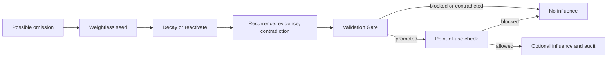
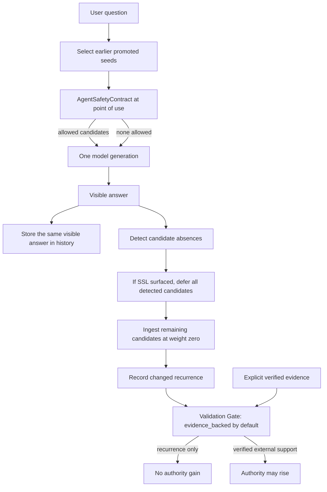

# Shadowseed Pro

<p align="center">
  <strong>An auditable research implementation of Shadow Seed Learning.</strong>
</p>

<p align="center">
  <a href="https://github.com/E-AI-MODEL/shadowseed-pro/actions/workflows/ci.yml">
    
  </a>
  
  
  
  
  
</p>

<p align="center">
  <code>trace &gt; 0</code> means remembered. <code>weight = 0</code> means no steering authority.
</p>

Shadow Seed Learning, or SSL, records a possible omission as a **candidate for investigation**, not as hidden truth. A new seed starts powerless, can be tested over time, and may influence retrieval or an answer only after a logged Validation Gate decision and a second point-of-use check.

> [!IMPORTANT]
> **Shadowseed Pro is research-ready, not production-ready.**
>
> The repository tests the mechanism and its safety boundaries. It does not establish general answer-quality improvement, a universal missing-information detector, a general neural signal for missing context, or safe deployment in high-impact settings.

> [!CAUTION]
> This repository has **no open-source license**. All rights are reserved. Public visibility is not permission for reuse. See [Rights and temporary licensing position](#rights-and-temporary-licensing-position).

## Research paper

**Shadowseed: Remembering Without Trusting**
*A Validation-Gated Memory Architecture for Language Model Systems*

[Read the paper (PDF)](paper/shadowseed-paper.pdf) · [LaTeX source](paper/main.tex) · [Bibliography](paper/references.bib)

## Start here

| Goal | Start here |
|---|---|
| Read the research paper | [Paper PDF](paper/shadowseed-paper.pdf) |
| Run the deterministic demo | [Quick start](#quick-start) |
| Use the practical tester environment | [Tester Workbench](#tester-workbench) |
| Understand the idea | [The idea in plain language](#the-idea-in-plain-language) |
| Audit the guarantees | [What the code enforces](#what-the-code-enforces) |
| Review evidence and limits | [Research status](#research-status) |
| Navigate the code and docs | [Architecture](#architecture) |

---

## Quick start

### Install and test

Requirements: Python 3.10 or newer and Git.

```bash
git clone https://github.com/E-AI-MODEL/shadowseed-pro.git
cd shadowseed-pro
python -m pip install --upgrade pip
pip install -e ".[test]"
python -m pytest -q
python -m ruff check .
```

### Run the deterministic chat demo

```bash
shadowseed chat --backend fixture --show-shadow
```

The fixture backend verifies pipeline mechanics. It is not evidence of real-model quality.

`shadowseed chat` and the `ShadowChatSession` API default to the product-oriented `live` runtime. Live mode produces one visible model answer per turn, stores that same answer in conversation history, and defaults to the `evidence_backed` Gate policy. Detected recurrence remains observable but cannot raise authority on its own. Verified external support enters through `ShadowChatSession.submit_evidence(...)`; the interactive command is `/support <seed_id> <source_ref>`. This API validates evidence shape and provenance, not source truth: the operator or host application is the trust anchor and must authenticate or verify a source before setting `verified=True`. Hard-coding that flag defeats the evidence-backed policy. Non-fixture live sessions reject the toy lexical hash embedder unless `--allow-toy-embedder` is supplied explicitly. The fixture default remains a deterministic mechanics test, and `shadowseed doctor` warns that lexical hashing is not a production semantic embedder. A local semantic setup can use:

```bash
pip install -e ".[models]"
shadowseed chat --backend ollama --model-id <model> --embedding-backend sentence-transformers
```

Research A/B behavior remains available explicitly with `--runtime-mode evaluation`; that mode keeps the isolated baseline arm.

### Tester Workbench

The 0.4 tester preview adds a local, single-user Workbench for practical testing
without writing Python code:

```bash
pip install -e ".[workbench]"
shadowseed doctor
shadowseed init
shadowseed workbench
```

The supported native server binds to `127.0.0.1` by default. Testers can create
or resume sessions, inspect stored seed decisions, record audit-only feedback,
compare baseline and SSL-visible answers, import scenarios, and export verified
reports or privacy-minimized support bundles. The Workbench is a tester product
layer over the existing runtime; it is not a second Validation Gate and does not
turn tester observations into scientific evidence.

See [`docs/workbench/README.md`](docs/workbench/README.md) for the practical
workflow and [`docs/workbench/limitations.md`](docs/workbench/limitations.md)
before sharing data or changing the default network binding.

For live-chat and core CLI guidance, see [`docs/usage/cli.md`](docs/usage/cli.md). Run `shadowseed --help` for the complete command list. Research-specific examples and reproducibility notes remain under [Activation-probe commands](#activation-probe-commands) and [Reproducibility rules](#reproducibility-rules).

<details>
<summary><strong>Common benchmark commands and optional dependencies</strong></summary>

```bash
shadowseed run-gap-suite
shadowseed run-false-positive-suite
shadowseed run-benefit-suite
shadowseed run-model-benefit-suite --backend fixture
shadowseed run-adversarial-gate-benchmark
shadowseed run-probe-utility-benchmark
shadowseed run-probe-feedback-behavior-suite
shadowseed analyze-results
```

```bash
pip install -e ".[models]"          # Hugging Face, Sentence Transformers, Torch
pip install -e ".[openai]"          # hosted OpenAI adapter
pip install -e ".[vector]"          # FAISS and Chroma
pip install -e ".[paper]"           # PDF paper pipeline
pip install -e ".[workbench]"       # local tester Workbench (Gradio 6)
pip install -e ".[dev]"             # all development extras
```

API keys must be supplied through environment variables. Never commit keys to source, fixture files, or workflow inputs.

</details>

---

## The idea in plain language

A fluent answer can still omit a causal boundary, dependency, stakeholder, alternative explanation, contradiction, or necessary question. SSL lets a detector say:

> Something specific may be missing here.

That statement is not accepted as fact. It becomes a small, testable seed with no authority over the answer. The system can remember it, look for recurrence, compare it with trusted material, try to falsify it, and record every decision.

### What a seed is

A seed is intended to represent one candidate absence. Atomicity is a **normalization target and tested heuristic**; normalization does not guarantee semantic atomicity, and a generated candidate can still be compound, vague, vacuous, or poorly split.

Good seed:

```text
The answer does not state whether the reported association is causal.
```

Too broad:

```text
The answer needs more context, nuance, limitations, causes, consequences, and alternatives.
```

### What SSL is not

SSL is not a claim that model intuitions are facts, a replacement for retrieval or source verification, a universal hallucination detector, or a production safety certification.

## The invariant

```text
trace  > 0   means the seed is present in shadow memory
weight = 0   means the seed has no steering authority
```

| Concept | Meaning | What it cannot do |
|---|---|---|
| `trace` | Presence, recurrence, decay, and reactivation | Grant influence by itself |
| `weight` | Bounded steering authority after validation | Rise because a detector sounds convincing |
| seed | A candidate absence | Count as evidence for itself |
| evidence | Verified external support with provenance | Bypass the Validation Gate |
| contradiction | A reason to block, reduce, or reset influence | Disappear from the audit trail |
| promotion | Permission to be considered | Force inclusion in an answer |
| surfacing | Contextual selection at use time | Override the point-of-use contract |

Detection is not validation. Promotion is not mandatory use. A signal is not a verdict.

## How a seed moves through the system


```mermaid
flowchart LR
    A[Possible omission] --> B[Weightless seed]
    B --> C[Decay or reactivate]
    C --> D[Recurrence, evidence, contradiction]
    D --> E[Validation Gate]
    E -->|blocked or contradicted| F[No influence]
    E -->|promoted| G[Point-of-use check]
    G -->|blocked| F
    G -->|allowed| H[Optional influence and audit]
```

The conversation runtime has two explicit modes. `live` is product-oriented; `evaluation` retains the isolated baseline arm used by research comparisons. Seed validation, surfacing, point-of-use authorization, and actual influence remain separate concerns in both modes.

<details>
<summary><strong>Live runtime, evaluation isolation, and lifecycle</strong></summary>

### Live runtime


```mermaid
flowchart TD
    Q[User question] --> U[Select earlier promoted seeds]
    U --> A[AgentSafetyContract at point of use]
    A -->|allowed candidates| M[One model generation]
    A -->|none allowed| M
    M --> V[Visible answer]
    V --> H[Store the same visible answer in history]
    V --> D[Detect candidate absences]
    D --> X[If SSL surfaced, defer all detected candidates]
    X --> N[Ingest remaining candidates at weight zero]
    N --> R[Record changed recurrence]
    R --> G[Validation Gate: evidence_backed by default]
    E[Explicit verified evidence] --> G
    G -->|recurrence only| B[No authority gain]
    G -->|verified external support| P[Authority may rise]
```

Live mode avoids the hidden-history split: the answer the user reads is the answer carried into the next turn. Candidate detection runs on that visible answer. If a seed influenced the generation, all candidates detected in that same answer are deferred because embedding similarity cannot prove causal provenance. This fail-closed rule prevents both close paraphrases and differently worded consequences from earning self-recurrence credit. Recurrence alone cannot raise authority under the live default policy; verified support must enter through the explicit evidence boundary with a stable source reference.

### Evaluation mode

`--runtime-mode evaluation` preserves the historical research harness: an uncontaminated baseline is generated and stored separately from a possible SSL-assisted answer. This mode exists for controlled A/B measurement and benchmark reproducibility; it is not the default for `shadowseed chat`.

### Lifecycle

```text
NEW -> ACTIVE -> DECAYING -> DORMANT -> EXPIRED
                         \-> PROMOTED
```

`EXPIRED` is terminal. A dormant seed may return through TrTL recognition, but an expired seed is not silently resurrected.

</details>

---

## What the code enforces

| Enforced property | Canonical implementation | Contract coverage |
|---|---|---|
| New seeds start weightless and authority fields are guarded | [`shadowseed.models`](src/shadowseed/models.py), [`shadowseed.intake`](src/shadowseed/intake.py) | [`test_authority_encapsulation.py`](tests/test_authority_encapsulation.py), [`test_models_extraction.py`](tests/test_models_extraction.py) |
| Trace and authority remain separate across decay and reactivation | [`shadowseed.lifecycle`](src/shadowseed/lifecycle.py) | [`test_lifecycle_ttl.py`](tests/test_lifecycle_ttl.py), [`test_lifecycle_extraction.py`](tests/test_lifecycle_extraction.py) |
| Gate-controlled effects use one typed, policy-bound engine | [`shadowseed.gate.runtime_adapter`](src/shadowseed/gate/runtime_adapter.py) | [`test_gate_path_unification.py`](tests/test_gate_path_unification.py), [`test_gate_boundary_completion.py`](tests/test_gate_boundary_completion.py) |
| Open contradiction records block influence and recovery is explicit | [`shadowseed.contradictions`](src/shadowseed/contradictions.py), [`shadowseed.gate`](src/shadowseed/gate/) | [`test_contradiction_lifecycle.py`](tests/test_contradiction_lifecycle.py), [`test_contradictions_extraction.py`](tests/test_contradictions_extraction.py) |
| Generated or unverified observations do not count as trusted evidence | [`shadowseed.ssot`](src/shadowseed/ssot.py), [`shadowseed.gate`](src/shadowseed/gate/) | [`test_ssot_manager.py`](tests/test_ssot_manager.py), [`test_gate_signal_routing.py`](tests/test_gate_signal_routing.py) |
| Influence requires positive weight, promotion, and a live current-version Gate event | [`AgentSafetyContract.decide_and_record`](src/shadowseed_agent/agent_contract.py) | [`test_point_of_use.py`](tests/test_point_of_use.py), [`test_agent_safety_contract.py`](tests/test_agent_safety_contract.py) |
| Live history stores the visible answer; evaluation mode preserves baseline isolation | [`shadowseed.chat`](src/shadowseed/chat.py) | [`test_live_runtime.py`](tests/test_live_runtime.py), [`test_shadow_chat.py`](tests/test_shadow_chat.py) |
| Gate decisions and influence attempts support strict in-process replay | [`GateEvent`](src/shadowseed/gate/events.py), [`AgentInfluenceRecord`](src/shadowseed_agent/audit_policy.py) | [`test_point_of_use.py`](tests/test_point_of_use.py) |

> **"Non-bypassable" is a public-API property over new authority decisions, not a Python-runtime claim.** The supported runtime routes new Gate-controlled decisions through one engine. Restoration reinstates validated persisted state, and explicitly unsafe test hooks remain callable by arbitrary in-process Python.

<details>
<summary><strong>Assurance boundaries, policy profiles, and evidence hierarchy</strong></summary>

### Assurance boundaries

- **Restoration reinstates authority; it does not create it.** `ShadowSeed.from_dict` and `SSLManager.restore_seed` validate and restore a prior snapshot without running the Gate. `replace_existing=True` can deliberately replace a live seed.
- **Atomicity is bounded.** A seed is normalized toward one candidate absence, but the runtime cannot guarantee that every model-generated proposal is meaningful or well split.
- **Audit immutability is type-specific.** `GateEvent` and `AgentInfluenceRecord` are frozen and replayable in process. `SeedEvent`, `ValidationGateResult`, and `ProbeFeedbackResult` are ordinary mutable Python objects.
- **Durable audit integrity is not implemented.** The runtime has no append-only, tamper-evident storage, cryptographic chaining, external timestamping, or write-once medium.
- **Point-of-use checks are specific, not universal safety.** Positive weight, `PROMOTED` status, and a live current-version Gate-event link are mandatory. `block_contradicted_seed=False` can relax the contradiction check. The legacy `require_logged_promotion` constructor field remains accepted for compatibility but has no effect on authorization.
- **Prompt-data quoting is a boundary, not injection prevention.** Surfaced seeds are presented as bounded candidate data. This does not solve every prompt-injection or evidence-poisoning attack.

### Gate policy profiles

- **`exploratory`**: qualifying recurrence or verified external support may raise authority when no unresolved contradiction exists. Recurrence never increments `evidence_count`. This remains the evaluation/research default.
- **`evidence_backed`**: verified external support is required. Recurrence may accompany it but cannot replace it. This is the `live` runtime default.
- **`legacy_evidence_required`**: compatibility behavior for the historical boolean API.

Verified external support must carry a non-empty `source_ref`. Reusing the same
source within the same signal kind is idempotent; the same reference under a
different signal kind is treated as distinct support. Independent confirmations
within one kind need distinct source references. Because the deprecated boolean
adapter cannot provide provenance, bare `external_evidence=True` on a
non-expired seed raises `ValueError` before a Gate event or authority change. An
expired seed instead records a terminal `EXPIRED` Gate event without applying
evidence or authority. Historical anonymous events remain replayable. Unverified
external observations remain visible in `GateEvent.signals` for audit but cannot
authorize a seed or be counted as passed evidence.

### Seed origin metadata

[`SeedOrigin`](src/shadowseed/models.py) records why a detector proposed a candidate. It is audit-only metadata and cannot raise weight or count as evidence.

### Trusted evidence is stored separately

[`SSOTManager`](src/shadowseed/ssot.py) keeps verified source material separate from uncertain seeds. Generated claims enter as unverified proposals and cannot validate a seed until explicitly verified.

### Dialectical falsification

[`dialectic_falsification.py`](src/shadowseed/benchmark/dialectic_falsification.py) challenges candidate absences against their source. Refutation routes through a Gate contradiction, survival can provide bounded feedback, and ambiguous output fails safe to an undecided result.

### Evidence hierarchy

1. Runtime code
2. Contract and regression tests
3. Benchmark implementation
4. CI or recorded execution
5. Result artifact with inputs and settings
6. Independent or human review
7. Replication or transfer
8. Documentation claim

#### Fixture versus real-model evidence

| Evidence type | What it can show | What it cannot show |
|---|---|---|
| deterministic fixture | command wiring, schemas, state transitions, logging | real detector quality or answer benefit |
| synthetic planted signal | whether an instrument can recover a known feature | whether the feature exists in a real model |
| one real-model run | behavior on that model, data, prompt, and environment | generalization |
| reviewed benchmark | performance under a stated review protocol | production safety |
| preregistered replication | whether a fixed claim survives a new sample | universal validity |

</details>

---

## Architecture

`SSLManager` is an orchestration and compatibility facade. Focused modules own the extracted implementation.

| Module | Responsibility |
|---|---|
| [`shadowseed.manager`](src/shadowseed/manager.py) | Runtime configuration, seed registry, audit collections, serialization, guarded authority mutation, and compatibility methods |
| [`shadowseed.models`](src/shadowseed/models.py) | Stable seed, lifecycle, validation-result, constellation, and probe data contracts |
| [`shadowseed.intake`](src/shadowseed/intake.py) | Embedding, normalization, deduplication, and seed creation/update |
| [`shadowseed.lifecycle`](src/shadowseed/lifecycle.py) | TTL decay, dormancy, TrTL reactivation, and terminal expiry |
| [`shadowseed.contradictions`](src/shadowseed/contradictions.py) | Contradiction records, blocking state, formal resolution, sequencing, and migration |
| [`shadowseed.vector_workflows`](src/shadowseed/vector_workflows.py) | Uncertain-region search, external-feedback routing, and constellations |
| [`shadowseed.gate`](src/shadowseed/gate/) | Typed signals, named policies, immutable Gate events, verified logging, and the executable decision engine |
| [`shadowseed_agent`](src/shadowseed_agent/) | Point-of-use eligibility and strict influence replay |

See the [architecture overview](docs/architecture/overview.md), [lifecycle and Gate specification](docs/architecture/lifecycle-and-gate.md), and [repository structure guide](docs/architecture/repository-structure.md) for the full ownership model.

<details>
<summary><strong>Repository map and authority classes</strong></summary>

### Repository map

```text
shadowseed-pro/
├── README.md                       repository front page
├── CHANGELOG.md                    user-visible structural and behavior changes
├── pyproject.toml                  packaging and tool configuration
├── repository-authority.yaml       machine-readable authority map
├── src/
│   ├── shadowseed/                 canonical runtime package
│   │   ├── adapters/               model and service adapters
│   │   ├── analysis/               result analysis
│   │   ├── benchmark/              evaluation and research implementations
│   │   ├── data/                   packaged fixtures and curated inputs
│   │   ├── detection/              candidate detectors
│   │   └── vectorstore/            memory, FAISS, and Chroma backends
│   └── shadowseed_agent/           point-of-use contract and audit policy
├── tests/                           contract, unit, integration, and regression tests
├── benchmarks/                      benchmark definitions and reviewed rounds
├── docs/                            architecture, research, usage, and migration docs
├── experiments/                     exploratory runners, not supported runtime
├── scripts/                         research and review utilities
├── results/                         local and generated analysis output
└── archive/                         frozen historical source material
```

### Repository authority

| Authority class | Meaning |
|---|---|
| `CANONICAL_SPEC` | Current architecture, packaging, or repository rules |
| `RUNTIME_IMPLEMENTATION` | Code shipped in the installed package |
| `CONTRACT_TEST` | Tests that pin runtime or compatibility behavior |
| `EVALUATION_IMPLEMENTATION` | Benchmarks, research instruments, and evaluation utilities |
| `EVIDENCE_ARTIFACT` | Curated or generated result material |
| `COMPATIBILITY_ONLY` | Legacy import facade with no independent logic |
| `HISTORICAL_REFERENCE` | Superseded material kept for provenance |
| `ARCHIVE` | Frozen source material excluded from the package |

The machine-readable source is [`repository-authority.yaml`](repository-authority.yaml). Archive material may explain history but cannot override current runtime code or canonical architecture documents.

</details>

---

## Research status

The methods/systems manuscript for the current architecture is available in [`paper/`](paper/README.md), with the compiled version at [`paper/shadowseed-paper.pdf`](paper/shadowseed-paper.pdf). It identifies the reviewed implementation commit separately from the 0.4.2 release artifact and keeps the existing efficacy claim boundary unchanged.

### Implemented and testable

- weightless-by-default seed intake;
- separate trace and authority state;
- TTL decay, dormancy, TrTL reactivation, and terminal expiry;
- typed Validation Gate signals and named policies;
- explicit contradiction records and resolution;
- verified SSOT evidence separated from generated proposals;
- a one-generation live loop plus a separately baseline-isolated evaluation loop;
- point-of-use eligibility with current-version Gate-event linkage;
- audit and strict in-process replay for Gate and influence decisions;
- deterministic fixtures plus optional Hugging Face, Ollama, OpenAI, FAISS, and Chroma routes;
- adversarial, retrieval, payoff, and activation-probe research instruments;
- committed null-result and replication artifacts for the small-model activation track.

### Not established

- general answer-quality improvement across open-ended tasks;
- a universal definition or detector for meaningful absence;
- a general internal neural representation of missing context;
- cross-domain or cross-lingual generalization of seed quality;
- reliable value from every promoted seed;
- calibration between seed weight and factual correctness;
- safety against all prompt-injection, evidence-poisoning, or seed-spam attacks;
- production readiness.

### Work still required for production use

Durable transactional storage, append-only or tamper-evident audit persistence, schema migrations, deterministic replay across versions, access control, privacy and retention controls, monitoring, rollback, backend isolation, rate limits, operator approval for high-impact actions, independent security review, and real-world evaluation remain open work.

<details>
<summary><strong>Project background, limitations, and open questions</strong></summary>

### Project origin and author note

Shadow Seed Learning began with a practical question:

> Can an AI system record a suspected omission, keep it powerless while it is uncertain, test it over time, and allow it to influence later work only after explicit validation?

The author is not a formally trained programmer or machine-learning researcher. The repository was developed through iterative, AI-assisted engineering, public research, explicit specifications, tests, benchmark rounds, and repeated attempts to disprove attractive results.

That limitation shaped the project: claims are linked to code, tests, or artifacts; generated proposals are separated from verified evidence; negative results are retained; and independent review remains necessary. The repository should be inspected because the decision path is visible, not trusted because its author sounds certain.

The project developed through stricter questions about atomic candidates, trace versus authority, decay and reactivation, Gate-controlled validation, point-of-use checks, open-set evaluation, and whether internal activations contain a reproducible signal related to candidate absence.


### Discussion and limitations

A missing point may be essential, optional, already implied, outside scope, unknowable, or invented by the detector. Recurrence can reflect importance or repeated detector bias. `weight` is steering authority, not probability. Promotion is permission to be considered, not proof of relevance.

Method limits include fixture dependence, small human review sets, model-generated labels in some experiments, limited activation-study scale, shared assumptions between implementation and tests, and missing broad independent replication.

| Tension | Current choice | Open question |
|---|---|---|
| Memory versus contamination | Visible history in live mode; baseline isolation in evaluation mode; same-turn candidate deferral after SSL influence | What useful candidates are deferred by the conservative live rule? |
| Persistence versus forgetting | TTL, TrTL, and expiry | How should decay vary by domain and risk? |
| Exploration versus distraction | Relevance thresholds and top-k | Can usefulness be predicted before generation? |
| Recurrence versus bias | Recurrence is distinct from evidence | How should correlated detector errors be measured? |
| Verification versus verifier error | Evidence and dialectical review | How should malicious or conflicting verifiers be handled? |
| Transparency versus overload | Full logs and authority maps | Can people review the trail efficiently? |
| Memory utility versus privacy | Explicit seed and evidence text | What is the minimum safe retained data? |

Open questions include reviewer agreement on meaningful absences, cross-language transfer, real answer benefit, negative controls, source credibility, cost-sensitive Gate thresholds, privacy-preserving memory, larger-model representation studies, and independent reproduction.

### Appropriate use today

Suitable uses include research inspection, mechanism testing, benchmark development, controlled local experiments, and discussion of auditable agent memory. Do not treat Shadowseed Pro as a ready safety layer for healthcare, education decisions, employment, finance, law, public administration, or autonomous high-impact action.


</details>

<details>
<summary><strong>Research track, scientific basis, references, and reproducibility</strong></summary>

### H-Neurons: code influence and separate experiment

H-Neurons appears here in two separate roles.

First, Shadowseed adapts a measurement pattern from Gao et al. for a different question: whether small-model activations linearly separate external dialectical verdicts about candidate absences. The implementation is [`src/shadowseed/benchmark/activation_probe.py`](src/shadowseed/benchmark/activation_probe.py). Sparse classifier features are reported as `candidate_neurons`, not established causal neurons.

Second, the repository contains a bounded small-model research track. Round 032 produced a tempting candidate signal that did not pass the corrected significance threshold. Round 033 preregistered fixed tests on a new case set; none passed. The defensible conclusion is a bounded null result: no reproducible linearly decodable dialectical-verdict signal was established in the evaluated models up to 0.5B parameters.

The result does not rule out nonlinear representations, other activation sites, larger datasets, or larger models. It also does not weaken the external runtime mechanics. The runtime must not depend on the tested internal signal.

```text
internal signal != evidence != verdict != permission to influence
```

Key material:

- [`docs/research/h-neurons-conclusion.md`](docs/research/h-neurons-conclusion.md)
- [`round_032/RESULTS.md`](benchmarks/open_review/rounds/round_032/RESULTS.md)
- [`round_033/RESULTS.md`](benchmarks/open_review/rounds/round_033/RESULTS.md)
- [`tests/test_activation_probe.py`](tests/test_activation_probe.py)

### Activation-probe commands

Mechanics-only smoke run:

```bash
shadowseed run-activation-probe \
  --backend fake \
  --input src/shadowseed/data/dialectic_falsification_fixture.json \
  --read-location neuron \
  --sparse-permutations 99 \
  --output results/activation_probe_fake.json
```

Real Hugging Face probe:

```bash
pip install -e ".[test,models]"

shadowseed run-activation-probe \
  --backend hf \
  --model-id Qwen/Qwen2.5-0.5B \
  --input src/shadowseed/data/dialectic_falsification_transfer_v3.json \
  --verdicts benchmarks/open_review/rounds/round_033/verdicts_run_29490380118.json \
  --pooling statement \
  --read-location neuron \
  --sparse-permutations 500 \
  --model-revision <immutable-hugging-face-commit-sha> \
  --require-verdict-coverage \
  --dtype float32 \
  --output results/activation_probe.json
```

Generate fresh external dialectical labels:

```bash
shadowseed run-dialectic-falsification \
  --backend openai \
  --model-id <model-id> \
  --input src/shadowseed/data/dialectic_falsification_transfer_v3.json \
  --output results/dialectic_verdicts.json
```

Pass the resulting verdict artifact to `run-activation-probe --verdicts`. Fresh model labels are not bit-reproducible by default, so preserve the artifact together with the model identifier and date.

A reproducible comparison needs a fixed model revision, dependencies, labels, case data, random seeds, and a plan written before inspecting the strongest layer.


### Scientific basis and exact claim boundaries

The references below provide problems, methods, counter-evidence, and precedents. They do not collectively prove Shadow Seed Learning.

### References

#### Missing information and memory

- Fu et al. (2025). **Absence Bench: Language Models Can't See What's Missing.** *NeurIPS 2025*. [Paper](https://papers.neurips.cc/paper_files/paper/2025/hash/36b31e1bb8ecd4f4081686448e9eff2d-Abstract-Datasets_and_Benchmarks_Track.html).
- Li, Kim, and Wang (2025). **QuestBench.** [arXiv:2503.22674](https://arxiv.org/abs/2503.22674).
- Kirichenko et al. (2025). **AbstentionBench.** [arXiv:2506.09038](https://arxiv.org/abs/2506.09038).
- Wu et al. (2025). **LongMemEval.** *ICLR 2025*. [Proceedings](https://proceedings.iclr.cc/paper_files/paper/2025/hash/d813d324dbf0598bbdc9c8e79740ed01-Abstract-Conference.html).

#### Verification, retrieval, and security

- Dhuliawala et al. (2024). **Chain-of-Verification.** *Findings of ACL 2024*. [Paper](https://aclanthology.org/2024.findings-acl.212/).
- Fatahi Bayat et al. (2025). **FactBench.** *ACL 2025*. [Paper](https://aclanthology.org/2025.acl-long.1587/).
- Jeong et al. (2024). **Adaptive-RAG.** *NAACL 2024*. [Paper](https://aclanthology.org/2024.naacl-long.389/).
- Asai et al. (2024). **Self-RAG.** *ICLR 2024*. [OpenReview](https://openreview.net/forum?id=hSyW5go0v8).
- Yao et al. (2025). **SeaKR.** *ACL 2025*. [Paper](https://aclanthology.org/2025.acl-long.1312/).
- Soudani et al. (2025). **Why Uncertainty Estimation Methods Fall Short in RAG.** *Findings of ACL 2025*. [Paper](https://aclanthology.org/2025.findings-acl.852/).
- Ge et al. (2025). **Resolving Conflicting Evidence in Automated Fact-Checking.** *IJCAI 2025*. [Paper](https://www.ijcai.org/proceedings/2025/1073).
- Zou et al. (2025). **PoisonedRAG.** *USENIX Security 2025*. [Paper](https://www.usenix.org/conference/usenixsecurity25/presentation/zou-poisonedrag).
- Debenedetti et al. (2024). **AgentDojo.** *NeurIPS 2024*. [Paper](https://proceedings.neurips.cc/paper_files/paper/2024/hash/97091a5177d8dc64b1da8bf3e1f6fb54-Abstract-Datasets_and_Benchmarks_Track.html).
- Farquhar et al. (2024). **Detecting Hallucinations Using Semantic Entropy.** *Nature*. [DOI](https://doi.org/10.1038/s41586-024-07421-0).

#### H-Neurons and internal representations

- Gao et al. (2025). **H-Neurons.** [arXiv:2512.01797](https://arxiv.org/abs/2512.01797). [Official implementation](https://github.com/thunlp/H-Neurons).
- Vaddi and Vaddi (2026). **Do Hallucination Neurons Generalize?** [arXiv:2604.19765](https://arxiv.org/abs/2604.19765).
- Alansari et al. (2026). **CrossHallu.** [arXiv:2607.04029](https://arxiv.org/abs/2607.04029).

#### Conceptual antecedents

- Kendall, A., and Gal, Y. (2017). **What Uncertainties Do We Need in Bayesian Deep Learning for Computer Vision?** *NeurIPS 2017*.
- Schmidhuber, J. (2010). **Formal Theory of Creativity, Fun, and Intrinsic Motivation.** *IEEE Transactions on Autonomous Mental Development, 2*(3), 230-247.
- Settles, B. (2009). **Active Learning Literature Survey.** University of Wisconsin-Madison.

### Reproducibility rules

Research runs should record the repository commit, Python and operating-system versions, package versions, model ID and immutable revision, dtype and device, input case and hash, prompt variant, pooling location, verdict artifact and coverage, random seeds, permutation count, correction method, preregistered hypotheses, and output artifact hash.

Do not select the strongest layer and then present its uncorrected p-value as confirmation. Discovery and confirmation require separate data or a preregistered test.


</details>

---

## Documentation

- [Architecture overview](docs/architecture/overview.md)
- [Lifecycle and Validation Gate](docs/architecture/lifecycle-and-gate.md)
- [Gate contracts](docs/architecture/gate-contracts.md)
- [Repository structure](docs/architecture/repository-structure.md)
- [Compatibility policy](docs/architecture/compatibility-policy.md)
- [CLI usage](docs/usage/cli.md)
- [Research status](docs/research/status.md)
- [H-Neurons conclusion](docs/research/h-neurons-conclusion.md)
- [Migration audit](docs/migration/source-audit.md)
- [Language policy](docs/migration/language-policy.md)
- [Authority map](repository-authority.yaml)
- [Changelog](CHANGELOG.md)

> [!NOTE]
> The core runtime code is English, and this is enforced automatically. Benchmark fixtures retain documented Dutch tokens and source-language material for compatibility. Historical Dutch material under [`archive/`](archive/) is provenance, not current runtime authority.

---

## Rights and temporary licensing position

**Copyright © 2026 H. Visser / E-AI-MODEL. All rights reserved.**

This repository intentionally has no open-source license at present. No general permission is granted to use, copy, modify, redistribute, publish, commercialize, or incorporate the original repository content into another product or service.

Public access is provided for inspection, research discussion, and evaluation. Reuse requires prior written permission from the copyright holder, except where applicable law, GitHub's Terms of Service, or a separate written agreement provides otherwise.

Third-party libraries, papers, datasets, model weights, quoted material, and archived external artifacts remain subject to their own rights and terms.

This is a temporary rights reservation. A later repository update may adopt a different license. Until then, no implied open-source license is granted.

For a legally binding licensing arrangement or commercial use, contact the repository owner and obtain professional legal advice.
