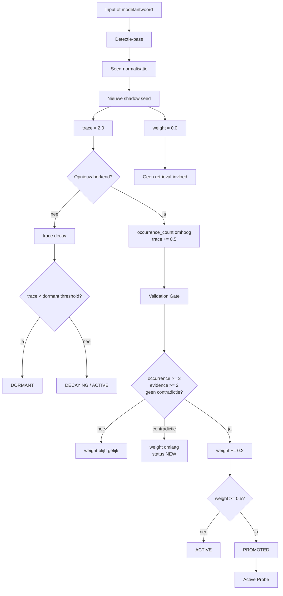

# Architectuur

## Hoofdflow



## Belangrijke bestanden

| Bestand | Rol |
|---|---|
| `src/shadowseed/manager.py` | bron voor SSL-formules en state |
| `src/shadowseed/benchmark/ssl45_gap_suite.py` | positieve Gap-Test Suite |
| `src/shadowseed/benchmark/ssl45_false_positive_suite.py` | negatieve controles |
| `src/shadowseed/benchmark/ssl45_benefit_suite.py` | fase 1 benefit-suite |
| `src/shadowseed/benchmark/ssl45_model_benefit_suite.py` | fase 2 model benefit-suite |
| `src/shadowseed/analysis/ssl45_result_analyzer.py` | analyse, Markdown, JSON en SVG |
| `.github/workflows/tests.yml` | CI voor tests, suites, artifacts, analyse en Wiki |
| `.github/workflows/slm-model-benefit.yml` | handmatige echte SLM-run |

## Bron van waarheid

De formules staan in code, niet in de Wiki:

```text
src/shadowseed/manager.py
```

De Wiki beschrijft de werking, maar de tests bewaken de implementatie.

## Canonieke data

De canonieke datasets staan onder:

```text
src/shadowseed/data/
```

Er hoort geen tweede dataset op rootniveau te staan.
