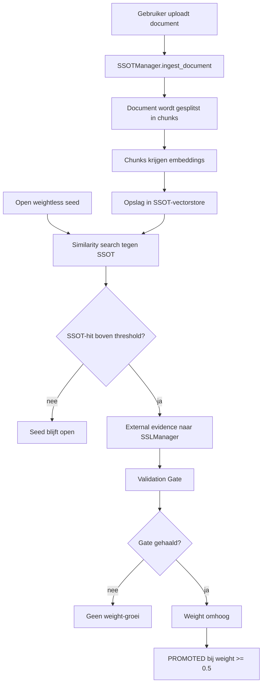

# SSOT en documentvalidatie

Deze pagina beschrijft de optionele SSOT-laag voor SSL 4.5.

## Doel

De SSOT-laag gebruikt door de gebruiker aangeleverde documenten als vertrouwde kennisbron. Een documentupload wordt daarmee niet alleen context voor een antwoord, maar ook externe evidence voor open shadow seeds.

## Belangrijk principe

```text
Seed-vectorstore = onzekere blinde vlekken
SSOT-vectorstore = vertrouwde documentchunks
SSLManager.seeds = bron van waarheid voor trace, weight en status
```

De SSOT kent dus niet zelf gewicht toe. De SSOT levert bewijs. De Validation Gate beslist of een seed invloed mag krijgen.

## Nieuwe onderdelen

| Onderdeel | Bestand | Rol |
|---|---|---|
| SSOTManager | `src/shadowseed/ssot.py` | documentchunks indexeren en seeds valideren |
| SSOT smoke runner | `src/shadowseed/benchmark/ssot_smoke.py` | reproduceerbare test |
| SSOT tests | `tests/test_ssot_manager.py` | unit tests voor ingest, retrieval en validatie |
| GH workflow | `.github/workflows/ssot-smoke.yml` | handmatige run + Wiki-output |

## Cyclus



## Waarom dit logisch volgt op de vectorstore-laag

De vectorstore-smoke toont dat gewichtloze seeds als embeddings kunnen worden teruggevonden. De SSOT-smoke voegt daar een tweede vectorruimte aan toe:

- de seed-store bewaart onzekerheid;
- de SSOT-store bewaart vertrouwde tekst;
- similarity koppelt beide;
- de Gate bewaakt invloed.

## Wat de smoke-run test

De handmatige workflow `SSOT Smoke Run` test:

1. een juridisch fixture-document wordt geïndexeerd;
2. het document wordt in SSOT-chunks gesplitst;
3. relevante context kan uit de SSOT worden opgehaald;
4. een open seed met `weight = 0.0` wordt tegen de SSOT gezocht;
5. SSOT-hits leveren externe evidence;
6. de seed wordt alleen via de Validation Gate gepromoot;
7. het resultaat wordt als artifact en Wiki-pagina opgeslagen.

## CLI

```bash
shadowseed run-ssot-smoke
```

Output:

```text
results/ssot_smoke.json
```

## GitHub Actions

Start handmatig:

```text
Actions → SSOT Smoke Run → Run workflow
```

Artifacts:

```text
ssl45-ssot-smoke-results
```

Wiki-output:

```text
SSOT-Smoke
SSOT-Smoke-Raw
```

## Grens van de claim

Deze eerste SSOT-laag gebruikt `InMemoryVectorStore` en een kleine fixture. Dit bewijst dat documentgestuurde validatie veilig in de bestaande SSL-lifecycle past.

Het bewijst nog niet dat grote PDF-collecties, OCR, bronconflicten of real-time kennisbanken volledig opgelost zijn. Dat is een volgende stap.

## Vervolg

Logische vervolgstappen:

1. echte uploadbestanden verwerken;
2. chunking verbeteren;
3. bronconflicten markeren;
4. confidence per bron toevoegen;
5. meerdere documenten als groeiende kennisbank testen;
6. later optioneel FAISS of Chroma toevoegen achter dezelfde `VectorStore` interface.
