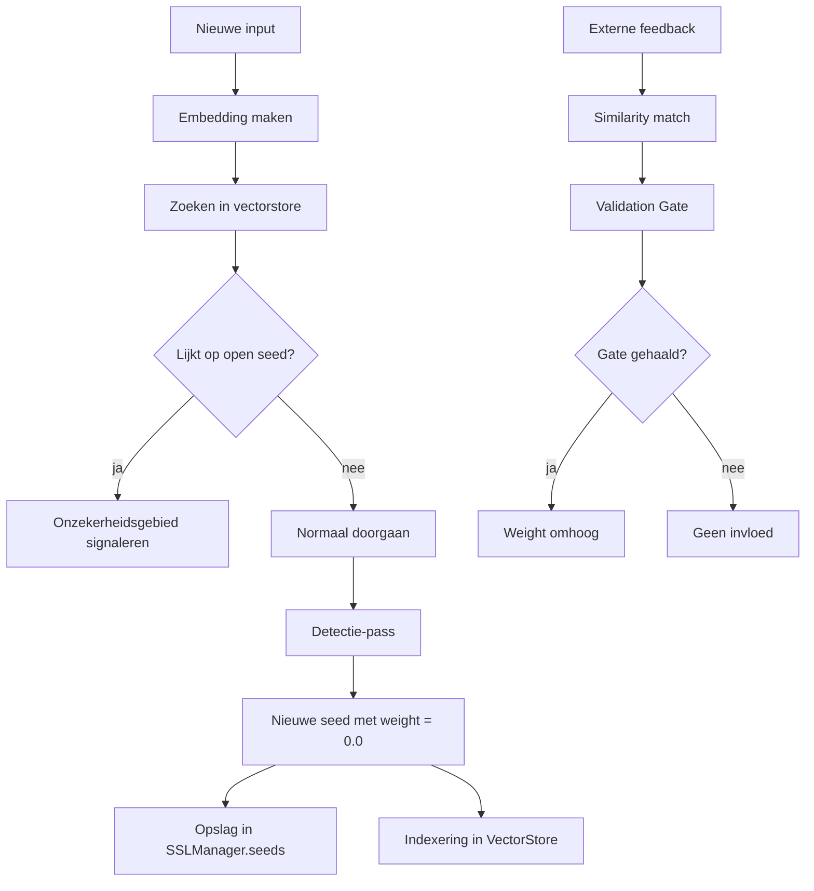

# Vectorstore en gewichtloze seeds

Deze pagina beschrijft de optionele vectorstore-laag voor SSL 4.5.

## Doel

Een shadow seed krijgt direct een embedding en kan daardoor in een vectorruimte worden teruggevonden. De seed blijft gewichtloos totdat externe feedback en de Validation Gate voldoende bevestiging geven.

## Belangrijk principe

```text
SSLManager.seeds = bron van waarheid
VectorStore = zoekindex
```

De vectorstore beslist dus niet zelf over promotie. Hij helpt alleen zoeken naar vergelijkbare onzekerheidsgebieden.

## Nieuwe onderdelen

| Onderdeel | Bestand | Rol |
|---|---|---|
| VectorStore interface | `src/shadowseed/vectorstore/base.py` | abstracte opslaglaag |
| InMemoryVectorStore | `src/shadowseed/vectorstore/memory.py` | dependency-vrije eerste implementatie |
| VectorConstellation | `src/shadowseed/vector_constellation.py` | hybride index + feedbacklog |
| Smoke runner | `src/shadowseed/benchmark/vectorstore_smoke.py` | reproduceerbare test |
| GH workflow | `.github/workflows/vectorstore-smoke.yml` | handmatige run + Wiki-output |

## Dagelijkse cyclus



## Waarom in-memory eerst?

FAISS of Chroma zijn nuttig, maar ze voegen extra dependencies toe. De eerste stap is daarom bewust klein:

- geen nieuwe zware dependency;
- CI blijft snel;
- interface ligt vast;
- gedrag is testbaar;
- latere FAISS/Chroma-implementatie kan achter dezelfde interface.

## Wat de smoke-run test

De handmatige workflow `Vectorstore Smoke Run` test:

1. seed wordt als vector opgeslagen;
2. seed start met `weight = 0.0`;
3. soortgelijke prompt vindt een open seed;
4. feedback loopt via de Validation Gate;
5. positieve feedback kan promotie veroorzaken;
6. tegenspraak verlaagt weight;
7. resultaten worden als artifact en Wiki-pagina opgeslagen.

## Wiki-output

Na een handmatige run verschijnen:

```text
Vectorstore-Smoke
Vectorstore-Smoke-Raw
```

## CLI

```bash
shadowseed run-vectorstore-smoke
```

Output:

```text
results/vectorstore_smoke.json
```

## Beperking

Deze laag bewijst nog niet dat FAISS of Chroma beter werken. Hij bewijst dat het concept van gewichtloze seeds in vectorruimte veilig in de bestaande SSLManager-lifecycle past.
