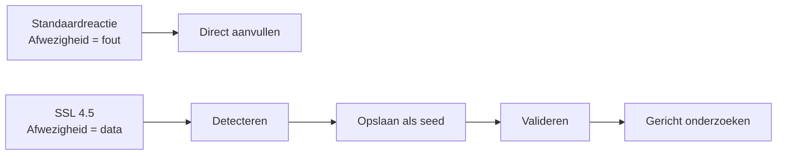
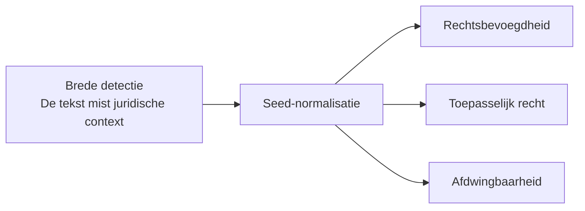
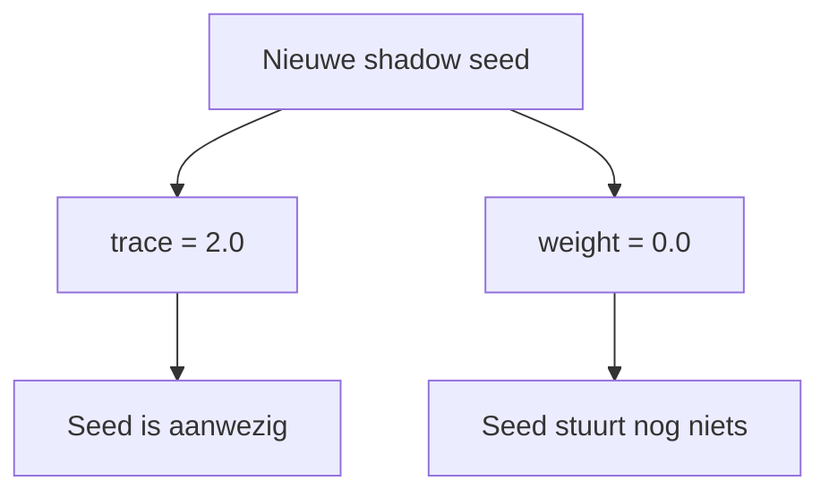
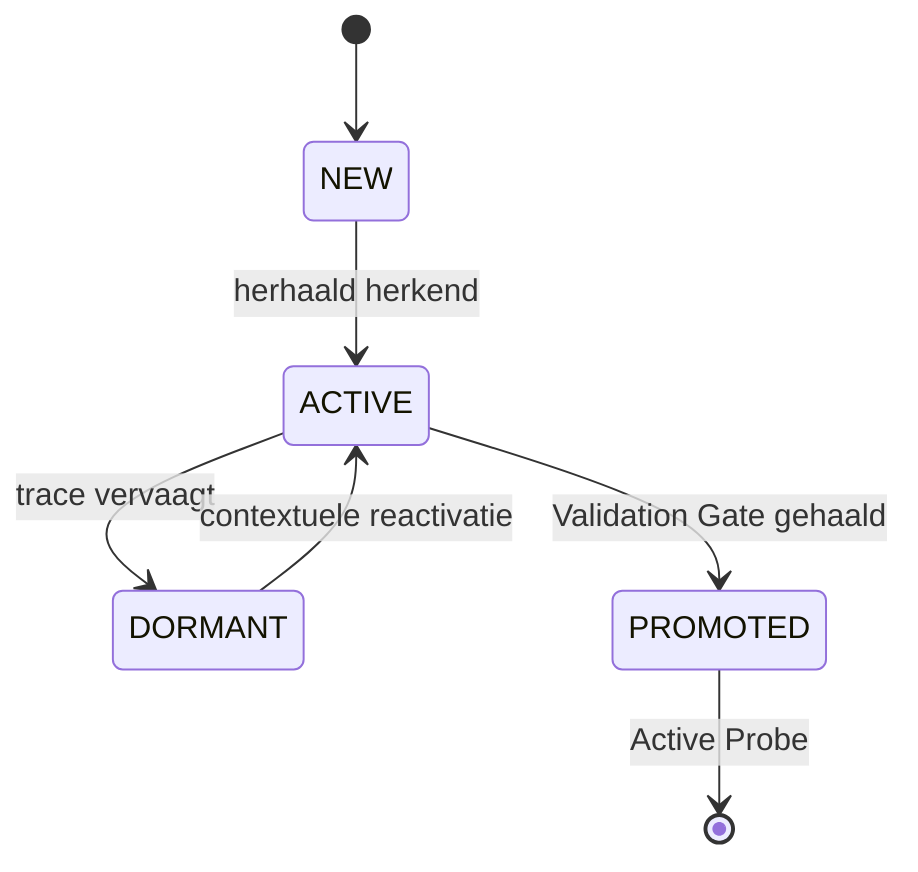
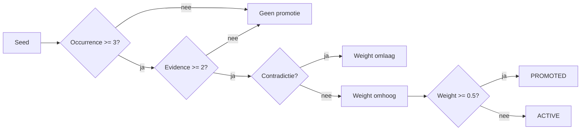
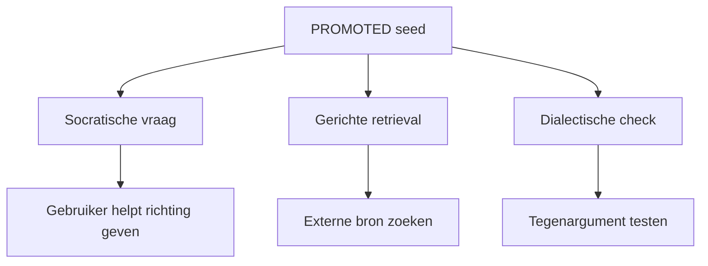
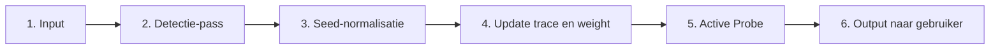
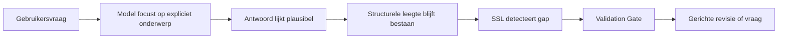
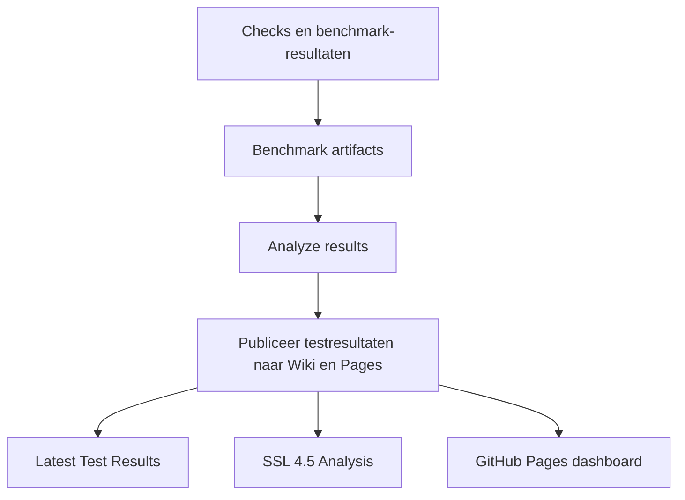

# Visueel verhaal SSL 4.5

> Status: achtergrondmateriaal. Deze pagina vertelt het conceptuele verhaal. Gebruik voor actuele status en resultaten eerst [Latest Test Results](Latest-Test-Results), [SSL 4.5 Analysis](SSL-45-Analysis), [Dashboard](Dashboard).

Deze pagina brengt de bruikbare elementen uit de aangeleverde SSL-decks samen in één doorlopend verhaal. De dia's zijn niet als losse slide-dump geplaatst. Ze zijn verwerkt als narratieve bouwstenen met compacte diagrammen en captions.

Bronmateriaal:

- `Shadow_Seed_Learning_4.5.pdf`
- `The_Epistemic_Blueprint.pdf`

## 1. Stelling

> Gaps zijn geen bugs. Gaps zijn brandstof.

SSL 4.5 begint bij een andere omgang met afwezigheid. Een ontbrekend structureel element is niet alleen een fout die direct moet worden gerepareerd. Het kan ook een signaal zijn dat het model helpt om zijn eigen blinde vlekken te onderzoeken.



**Caption.** Gebaseerd op de paradigmaverschuiving uit het SSL 4.5-deck en de Blueprint-dia over gaps als brandstof.

## 2. De kernregel: één seed, één gap

Een shadow seed moet klein, specifiek en toetsbaar zijn. Brede detecties worden eerst gesplitst.



**Werkregel.** Een seed bevat precies één ontbrekende relatie.

Goede seed:

```text
Toepasselijk recht bij een grensoverschrijdend consumentencontract.
```

Te breed:

```text
De juridische context ontbreekt.
```

## 3. Aanwezigheid is niet hetzelfde als invloed

De sterkste visuele boodschap uit beide decks is de scheiding tussen `trace` en `weight`.

| Veld | Betekenis | Startwaarde |
|---|---|---:|
| `trace` | aanwezigheid of herkenning | `2.0` |
| `weight` | operationele invloed | `0.0` |



**Caption.** Dit voorkomt dat elke losse detectie meteen retrieval of generatie beïnvloedt.

## 4. Lifecycle: eerst spoor, dan bewijs, dan invloed

Een seed mag pas invloed krijgen als hij herhaald terugkomt en door de Validation Gate komt.



**Caption.** De seed gedraagt zich eerst als geheugenachtig spoor. Invloed komt pas later.

## 5. De Validation Gate

De Validation Gate bestaat uit drie checks. Die voorkomen ruis, echo-kamers en valse zekerheid.



**Caption.** In de huidige implementatie stijgt `weight` met `0.2` per geldige Gate-pass. Een seed wordt promoted bij `weight >= 0.5`.

## 6. Wat doet een promoted seed?

Een promoted seed is geen waarheid op zichzelf. Hij start gerichte actie.



**Caption.** De seed stuurt onderzoek. Hij vervangt het oordeel niet.

## 7. Zes stappen onder de motorkap

De Blueprint-dia met de zesstaps cyclus is bruikbaar als compacte procesplaat.



**Caption.** Voor de gebruiker blijft vooral stap 1 en stap 6 zichtbaar. De SSL-laag werkt ertussen als observatie- en validatielaag.

## 8. SSL naast RAG en reflectie

SSL vervangt bestaande systemen niet. Het voegt een observatielaag toe.

| Systeem | Trigger | Doel | Horizon |
|---|---|---|---|
| RAG | gebruikersvraag | antwoord ophalen | single-turn |
| FLARE / confidence retrieval | lage zekerheid | lokaal aanvullen | single-turn |
| Reflectie | fout of instructie | gedrag aanpassen | multi-turn |
| SSL 4.5 | structurele afwezigheid | actief verkennen | lifecycle |

**Caption.** SSL is vooral nuttig wanneer kleine structurele afwezigheden over meerdere stappen relevant blijven.

## 9. Het blind spot probleem

Een gewone vraag kan focussen op wat expliciet genoemd wordt, terwijl het ontbrekende kader buiten beeld blijft.



**Voorbeeld.** Een juridisch antwoord over EU-garantie kan materieel kloppen, maar rechtsbevoegdheid en toepasselijk recht missen.

## 10. Bewijsvoering in deze repo

De repo test niet alleen of SSL mooi klinkt. De standaardroute meet of de huidige implementatie reproduceerbare output maakt.



**Caption.** De Wiki-resultaten en Pages-output komen uit dezelfde artifact snapshot. De herkomst staat in `manifest.json`.

## 11. Wat SSL niet claimt

SSL 4.5 is niet:

- een nieuw foundation model;
- training van modelgewichten;
- een hallucinatiefilter;
- een waarheidsmachine;
- een vervanging voor RAG;
- bewijs voor algemene state-of-the-art prestaties.

SSL 4.5 is wel:

- een observatielaag;
- een geheugenlaag voor afwezigheid;
- een validatielaag;
- een manier om blinde vlekken toetsbaar te onderzoeken.

## 12. Printbare kernconclusie

De visuele verhaallijn kan zo worden samengevat:

```text
Ontbrekende structuur wordt detecteerbaar.
Detectie wordt een gewichtloze seed.
Herhaling versterkt trace, niet invloed.
Validatie opent pas de route naar weight.
Promoted seeds sturen gerichte exploratie.
De benchmark meet of dat betere antwoorden oplevert.
```

Daarmee blijft de visie van SSL intact: het gaat niet om meer tekst, maar om beter onderzochte afwezigheid.

## 13. Plaats in de Wiki

Deze pagina is achtergrondmateriaal. De actuele route loopt via:

- [Home](Home)
- [Latest Test Results](Latest-Test-Results)
- [SSL 4.5 Analysis](SSL-45-Analysis)
- [Dashboard](Dashboard)
- `verhaal.html` in de repo-root (standalone interactief verhaal)

Gerelateerde achtergrondpagina's:

- [Conceptueel overzicht](Conceptueel-Overzicht)
- [Waarom SSL niet naïef is](Waarom-SSL-niet-naief-is)
- [Roadmap](Roadmap)
- [Blind review protocol](Blind-Review-Protocol)
