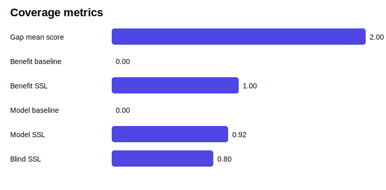
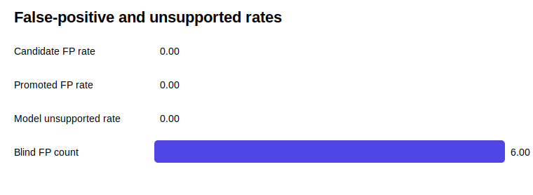

# SSL 4.5 resultaatanalyse

Deze analyse is automatisch gemaakt uit benchmark-JSON artifacts.

## Conclusie

**De fixture-run bevestigt dat de model-benefit harness werkt.**

De fixture-backend laat zien dat de meetketen werkt: baseline coverage stijgt na SSL-guided rewrite zonder unsupported additions. Dit is een technische smoke-test, geen echte SLM-claim.

### Onderbouwing

- De positieve Gap-Test Suite wordt volledig geraakt.
- De false-positive controls blijven schoon op promoted false positives.
- De benefit-suite laat hogere gap coverage zien na SSL-toevoegingen.
- De blinde smoke-test is aanwezig, maar vraagt nog controle op coverage en false positives.
- De SSL-antwoorden zijn langer; daarom moet coverage-winst samen met lengtecorrectie en unsupported additions worden gelezen.

### Grens van de claim

Deze conclusie geldt alleen voor de huidige suite, het gebruikte model en de vastgelegde prompts. Voor een algemene claim zijn meer scenario's, meerdere modellen en blind review nodig.

## Samenvatting

| Suite | Belangrijkste uitkomst |
|---|---:|
| Gap Finder mean score | 2.00 |
| Gap Finder promoted hits | 10 |
| False-positive promoted rate | 0.00 |
| Antwoordwinst coverage delta | 1.00 |
| Model smoke backend | fixture |
| Model smoke coverage delta | 0.92 |
| Model smoke unsupported rate | 0.00 |
| Blinde smoke coverage delta | 0.80 |
| Blinde smoke false positives | 6 |
| Mean answer length delta | 26.67 |

## Grafieken

## Herhalingstest

| Rondes | Mean score | Promoted hits |
|---:|---:|---:|
| 1 | 2.00 | 0 |
| 2 | 2.00 | 0 |
| 3 | 2.00 | 10 |
| 5 | 2.00 | 10 |
| 8 | 2.00 | 10 |

## Semantische seed-samenvatting

Aantal promoted seed-vermeldingen in geanalyseerde positieve outputs: **29**.

Let op: dit zijn vermeldingen, geen unieke seeds. Dezelfde seed kan in meerdere suites terugkomen.

### Toptermen

| Term | Aantal |
|---|---:|
| medische | 6 |
| gezondheidsdata | 6 |
| koloniaal | 3 |
| kapitaal | 3 |
| financieringsbron | 3 |
| britse | 3 |
| fabrieksinvesteringen | 3 |
| goedkope | 3 |
| koloniale | 3 |
| grondstoffen | 3 |
| voorwaarde | 3 |
| schaalvergroting | 3 |

### Per domein

#### geschiedenis en economie

- Koloniaal kapitaal als financieringsbron voor Britse fabrieksinvesteringen.
- Goedkope koloniale grondstoffen als voorwaarde voor schaalvergroting van productie.
- Koloniaal kapitaal als financieringsbron voor Britse fabrieksinvesteringen.
- Goedkope koloniale grondstoffen als voorwaarde voor schaalvergroting van productie.
- Koloniaal kapitaal als financieringsbron voor Britse fabrieksinvesteringen.
- Goedkope koloniale grondstoffen als voorwaarde voor schaalvergroting van productie.

#### recht en jurisdictie

- Rechtsbevoegdheid bij een geschil tussen een Nederlandse consument en een Amerikaanse webwinkel.
- Toepasselijk recht bij een grensoverschrijdend consumentencontract.
- Afdwingbaarheid van EU-consumentenrecht tegenover een niet-EU retailer.
- Forumkeuzebeding in internationale online koopvoorwaarden.
- Rechtsbevoegdheid bij een geschil tussen een Nederlandse consument en een Amerikaanse webwinkel.
- Toepasselijk recht bij een grensoverschrijdend consumentencontract.
- Afdwingbaarheid van EU-consumentenrecht tegenover een niet-EU retailer.
- Forumkeuzebeding in internationale online koopvoorwaarden.
- Rechtsbevoegdheid bij een geschil tussen een Nederlandse consument en een Amerikaanse webwinkel.
- Afdwingbaarheid van EU-consumentenrecht tegenover een niet-EU retailer.
- Forumkeuzebeding in internationale online koopvoorwaarden.

#### IT en engineering

- AVG-compliance bij verwerking van medische hartslagdata.
- Authenticatiestrategie voor toegang tot gezondheidsdata.
- Encryptie van medische data in rust en tijdens transport.
- Rate-limiting op API's die gezondheidsdata verwerken.
- AVG-compliance bij verwerking van medische hartslagdata.
- Authenticatiestrategie voor toegang tot gezondheidsdata.
- Encryptie van medische data in rust en tijdens transport.
- Rate-limiting op API's die gezondheidsdata verwerken.
- AVG-compliance bij verwerking van medische hartslagdata.
- Authenticatiestrategie voor toegang tot gezondheidsdata.
- Encryptie van medische data in rust en tijdens transport.
- Rate-limiting op API's die gezondheidsdata verwerken.

## Interpretatie

Deze analyse scheidt vijf dingen:

1. of SSL de juiste gaps vindt;
2. of SSL geen false positives promoot;
3. of SSL-guided antwoorden meer gevalideerde gap coverage krijgen dan baseline-antwoorden;
4. of de blinde smoke-test labels gescheiden houdt van detectie;
5. of herhaalde rondes het gedrag veranderen.

Een positief resultaat betekent dus niet automatisch dat SSL algemeen werkt. Het betekent dat de gemeten suite beter scoort onder de vastgelegde voorwaarden.
