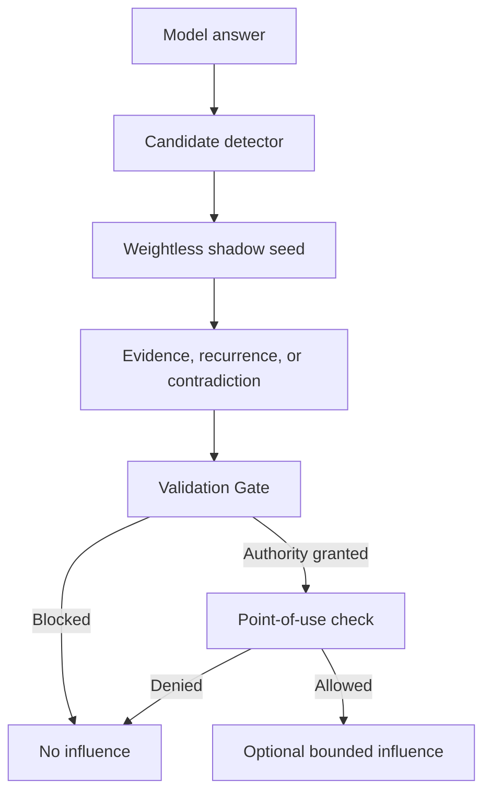
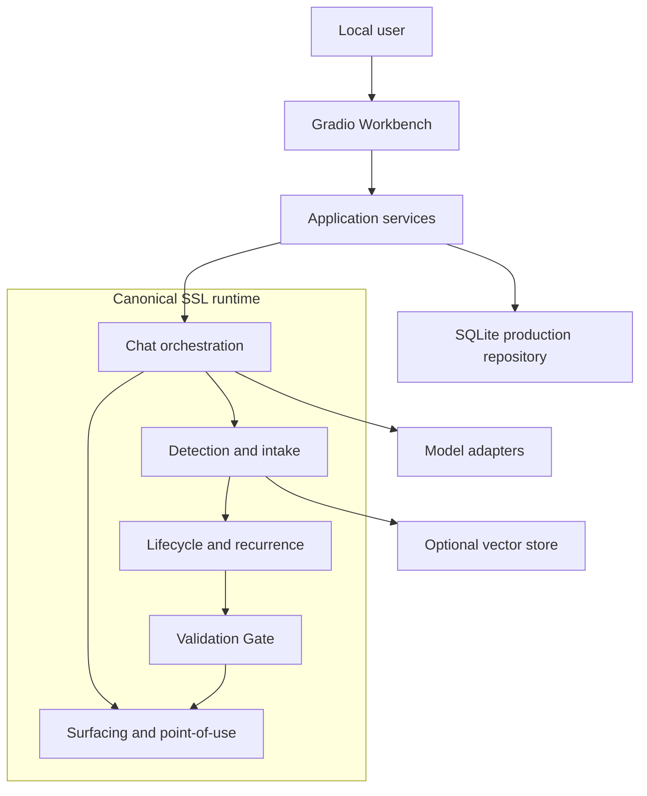
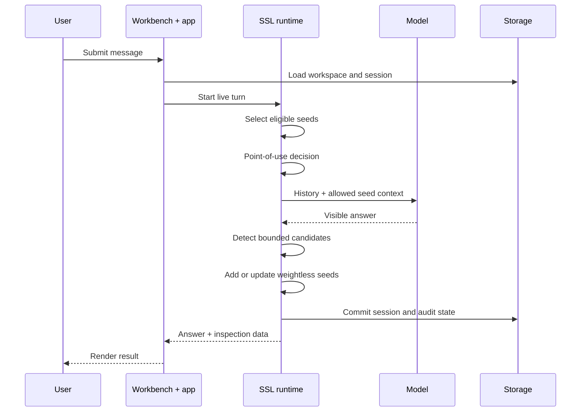
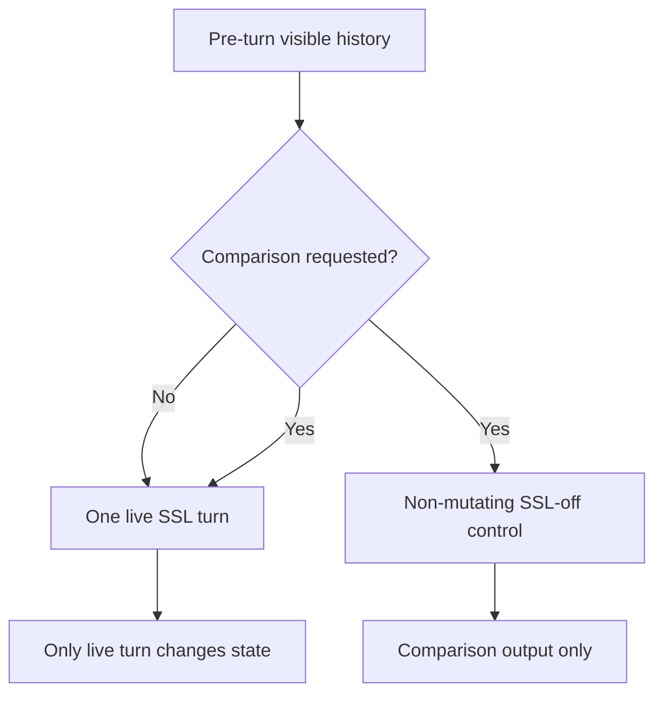
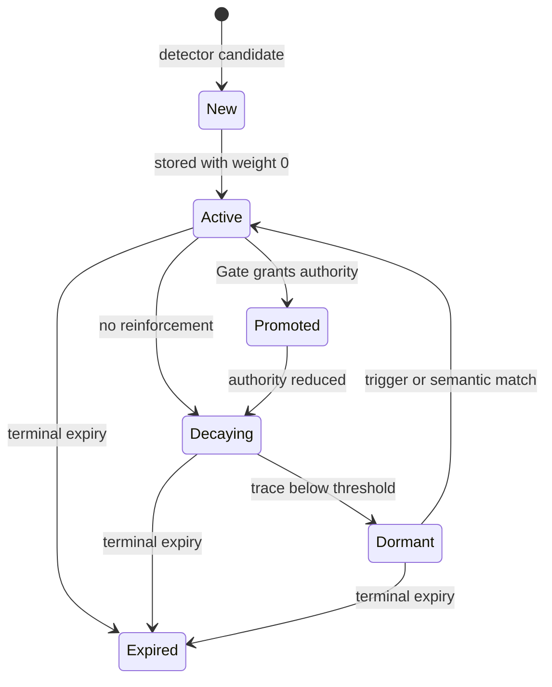
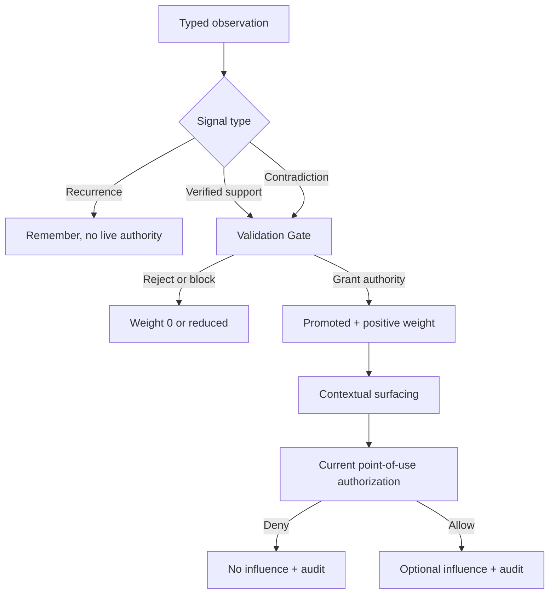
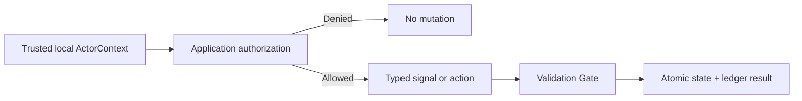
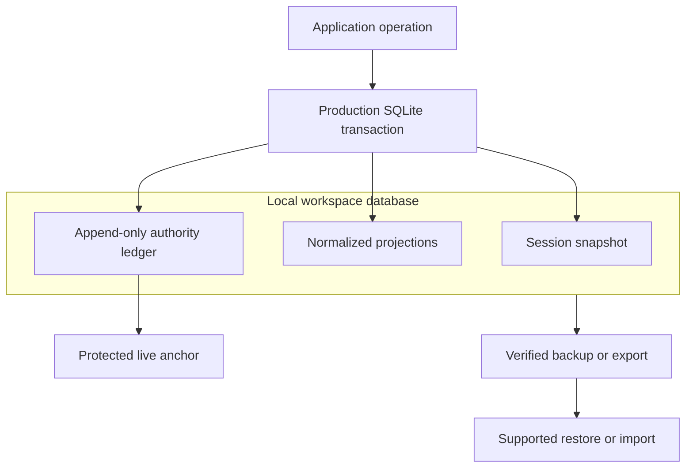
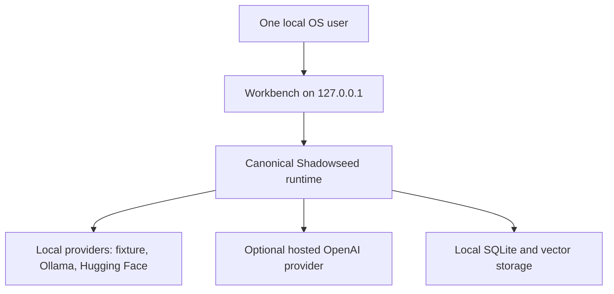
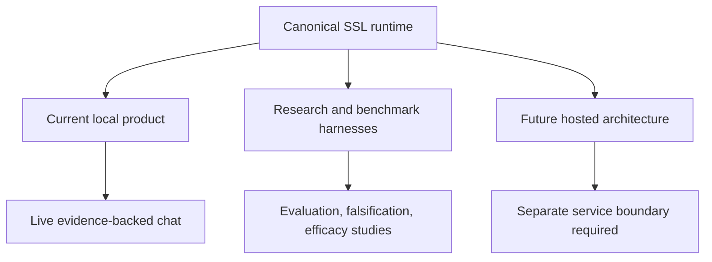

# Shadowseed Pro High-Level Design

**Authority flow, local deployment, persistence, and trust boundaries**

| Field | Value |
|---|---|
| Product version | 0.7.1 |
| Runtime source anchor | `3627ed0df08c3a22e36da047b888291400deb312` |
| Document type | As-built high-level design |
| Deployment described | Local, single-user Workbench |
| Product status | Research-ready; production-local assurance candidate |
| Explicitly not described as current | Hosted production, multi-user service, proven general answer-quality improvement |

This document explains how the shipped Shadowseed Pro product is assembled and how a possible omission can be remembered without silently becoming trusted guidance. It translates the canonical architecture into a compact visual model. The detailed contracts in [`docs/architecture/`](./) and the runtime remain authoritative when this summary omits implementation detail.

## 1. What Shadowseed Pro does

Shadowseed Pro adds a controlled memory path beside ordinary model generation. A detector may identify a bounded epistemic candidate: a possible missing condition, causal boundary, stakeholder, contradiction, dependency, or question worth investigating.

The candidate is not accepted as fact. It enters shadow memory with presence but no steering authority:

```text
trace > 0   means remembered
weight = 0  means no steering authority
```

Only verified external support can grant authority in the ordinary live `evidence_backed` policy. Even an authorized seed must pass contextual surfacing and a fresh point-of-use check before it can be supplied to a model.



This is a memory-and-authority architecture, not a conventional document-retrieval RAG service. Optional vector stores support similarity and retrieval workflows, but they do not decide truth or authority.

## 2. As-built product architecture

The shipped product is one local Python application. The Gradio Workbench calls UI-independent application services, which coordinate the canonical SSL runtime. Storage, model providers, and optional vector backends remain adapters around that runtime.



### Layer responsibilities

| Layer | Responsibility | Main code |
|---|---|---|
| Workbench | Chat-first local interface, session inspection, comparison, evidence and export controls | `shadowseed.workbench` |
| Application services | Session, workspace, authorization, limits, provider policy, health, feedback, exports and recovery coordination | `shadowseed.application` |
| Canonical runtime | Candidate intake, lifecycle, recurrence, Gate decisions, surfacing and conversation behavior | `shadowseed.*`, `shadowseed.gate` |
| Point of use | Final eligibility decision and influence audit | `shadowseed_agent` |
| Persistence | Versioned SQLite state, production ledger, integrity verification, backup and recovery | `shadowseed.storage` |
| Adapters | Fixture, Ollama, Hugging Face, OpenAI, embeddings and optional vector stores | `shadowseed.adapters`, `shadowseed.vectorstore` |

The Workbench may present controls, but it cannot create a second authority engine. Gate-controlled authority changes remain inside the canonical Validation Gate.

## 3. One live chat turn

A live turn separates visible conversation, optional influence, candidate detection, and durable state. The answer shown to the user becomes normal conversation history. Candidate detection occurs after generation and produces observations, not trusted facts.



### Same-message SSL-off comparison

The optional control branch starts from the same pre-turn visible history and uses the same model configuration. It receives no surfaced seeds and cannot create candidates, recurrence, Gate events, or later conversation history.



A textual difference between both answers is not automatically an SSL effect. Such an attribution is defensible only when an authorized seed actually surfaced in the live arm.

## 4. From candidate to possible influence

Shadowseed separates observation from authority. `trace` records remembered presence and recurrence. `weight` represents bounded steering authority. Recurrence may strengthen an observation under an exploratory research policy, but it is not external evidence and cannot grant authority in the ordinary live policy.



### Decision path



Three protections matter:

- Authority fields cannot be assigned through the normal public API.
- A Gate event is tied to the current `authority_version`; stale authorization does not remain valid after authority changes.
- Promotion permits consideration. It does not force use in an answer.

## 5. Permission to request is not authority to decide

The local production profile assumes one logical workspace owner inside one operating-system account. It does not need a multi-user login screen, but authority-bearing actions still require a trusted local actor identity and an explicit capability.



| Action | Required capability | What authorization permits | What it cannot do |
|---|---|---|---|
| Use chat | `chat.use` | Start a normal product turn | Grant seed authority |
| Verify evidence | `evidence.verify` | Submit operator-verified support | Force Gate promotion |
| Submit contradiction | `contradiction.submit` | Create an attributable blocking challenge | Edit weight directly |
| Resolve contradiction | `contradiction.resolve` | Close a contradiction with a recorded basis | Restore authority silently |
| Export | `export.create` | Create an explicit user-controlled export | Change runtime state |
| Backup or restore | `workspace.backup_restore` | Run the supported recovery workflow | Bypass integrity checks |

Application authorization answers who may request an operation. The Validation Gate separately decides what that operation means for seed authority. A checkbox or client-supplied boolean is never sufficient production authorization.

## 6. The ledger makes authority history verifiable

The local production repository uses SQLite for current state and an append-only authority ledger. Authority mutations and their ledger events share one database transaction. A protected anchor outside the ordinary workspace detects replacement with an older, internally valid database.



### Stored information

| Store | Purpose | Content rule |
|---|---|---|
| Session snapshot | Resume current conversation and SSL state | May contain prompts, answers and seed text |
| Normalized projections | Query current turns, seeds and feedback | Replaceable view of application state |
| Authority ledger | Verify authority and influence history | Minimal typed metadata and cryptographic commitments |
| Protected anchor | Detect rollback of the workspace ledger | Kept outside normal database, backups and exports |
| Support bundle | Privacy-minimized tester diagnostics | Omits prompts, answers, seed text and free notes |
| Full report | Detailed research review | Content-bearing and treated as sensitive |

Normal operational logs reject raw prompts, answers, seed text, evidence notes and credential-like values. Session deletion removes declared session content while retaining only the minimal ledger continuity required by the documented audit model. Full workspace erase also removes the workspace-specific protected integrity material, subject to platform behavior.

## 7. Deployment and provider boundaries

The supported production-local launcher binds the Workbench to `127.0.0.1`. The operating-system user boundary protects the local product. Exposing the generic development server remotely does not turn it into a hosted production service.



| Dependency | Location | Data movement | Product rule |
|---|---|---|---|
| Deterministic fixture | In process | No external model traffic | Mechanics only, not quality evidence |
| Ollama | Local service | Prompt and context stay on configured local endpoint | One bounded request, no automatic fallback |
| Hugging Face Transformers | Local process | Model files may be acquired; generation remains local | Explicit model provenance for research runs |
| OpenAI | Hosted provider | Relevant chat or embedding content leaves the local boundary | Explicit selection, credential and provider confirmation |
| Memory / FAISS / Chroma | Local adapter | Embeddings and vector records remain in selected store | Similarity does not grant authority |

The current profile has no built-in multi-user authentication, tenant isolation, hostile-network security boundary, public TLS termination, or hosted abuse protection.

## 8. Product, research, and future hosted work

The repository contains three different concerns. They share code and concepts, but they do not make the same claims.



| Concern | Current state | Valid claim |
|---|---|---|
| Local product | Implemented and packaged | Research-ready and locally mass-testable |
| Production-local assurance | Implemented candidate controls; release and soak gates still govern the final label | Candidate, not an unqualified production-ready claim |
| Research harnesses | Implemented | Can measure declared protocols; results depend on the actual study |
| General answer-quality benefit | Not established | No universal improvement claim |
| Hosted multi-user product | Architecture requirements accepted, runtime not implemented | No hosted-production claim |

A hosted version may reuse the canonical runtime and Gate. It requires a new service boundary with authenticated principals, tenant-safe storage, authorization on every object, TLS, rate and cost limits, managed secrets, retention and deletion workflows, monitoring, incident procedures, and cross-tenant adversarial testing. The local Gradio process is not that boundary.

## 9. Technology and component map

| Area | Current implementation |
|---|---|
| Language and packaging | Python 3.10+, setuptools, wheel/sdist and standalone PyInstaller bundles |
| User interface | Gradio 6 Workbench |
| Local persistence | SQLite with versioned schema, recovery and integrity support |
| Model backends | Fixture, Ollama, Hugging Face Transformers, OpenAI |
| Embeddings | Lexical, Sentence Transformers, OpenAI where explicitly selected |
| Vector backends | In-memory, optional FAISS, optional Chroma |
| Validation | Typed signals, named Gate policies, immutable Gate events |
| Point of use | `shadowseed_agent.AgentSafetyContract` |
| Quality controls | Pytest contracts, Ruff, packaging checks, exact-source release verification |
| Distribution status | PolyForm Noncommercial 1.0.0; commercial rights require separate permission |

### Source map

- [`overview.md`](overview.md): canonical runtime structure and authority model.
- [`lifecycle-and-gate.md`](lifecycle-and-gate.md): lifecycle, Gate, contradiction, and point-of-use contracts.
- [`production-actor-authorization.md`](production-actor-authorization.md): actor context and capabilities.
- [`production-persistence-and-audit.md`](production-persistence-and-audit.md): ledger, anchor, backup, recovery, and deletion.
- [`ADR-005`](adr/ADR-005-chat-first-product-surface.md): chat-first product behavior and SSL-off comparison.
- [`ADR-006`](adr/ADR-006-production-local-boundary.md): local single-user production boundary.
- [`ADR-007`](adr/ADR-007-hosted-production-boundary.md): separate requirements for future hosted production.
- [`production-local.md`](../workbench/production-local.md): supported launcher, limits, logging, and recovery behavior.
- [`status.md`](../research/status.md): current scientific evidence and bounded claims.

## Interpretation rule

Use this document as a readable map. Use the linked canonical documents and runtime tests for exact behavior. A later code or architecture change can make this snapshot stale; update the source anchor and regenerate the PDF after such a change.
