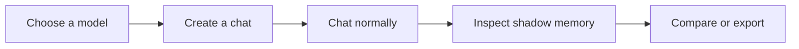
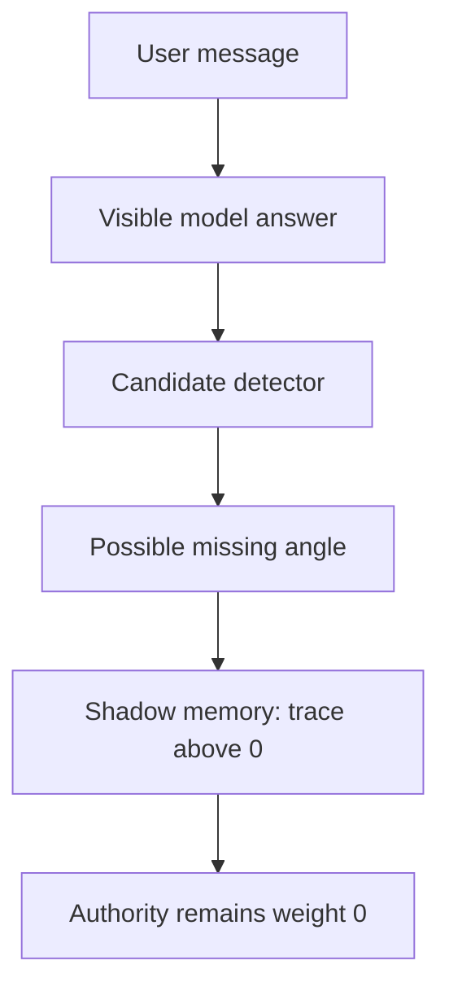
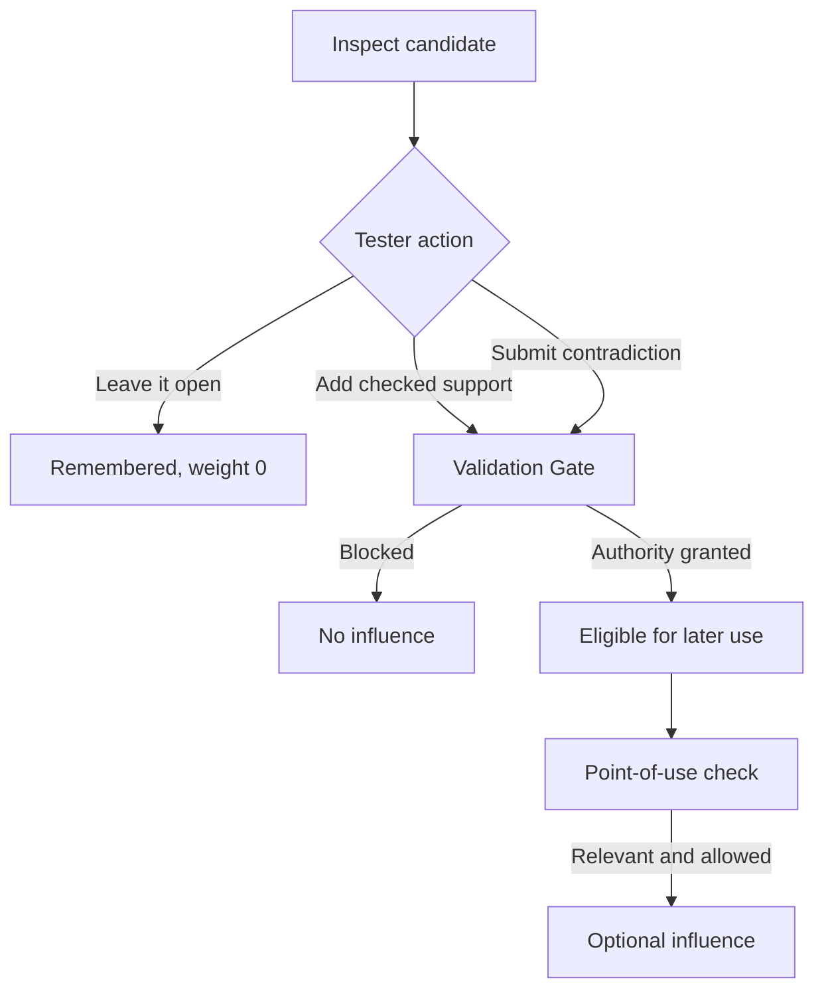
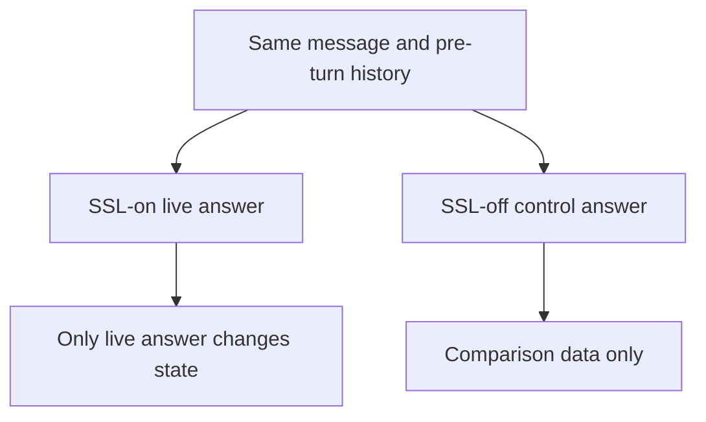

# Shadowseed Pro: The Product We Are Building

**A product walkthrough of gated shadow memory for ordinary LLM conversations**

| Field | Value |
|---|---|
| Product version | 0.7.1 |
| Runtime source anchor | `3627ed0df08c3a22e36da047b888291400deb312` |
| Primary user | Tester or researcher working with an LLM |
| Main product | Local standalone chat Workbench |
| Default experience | Live chat with the `evidence_backed` Gate policy |
| Product status | Research-ready; production-local assurance candidate |

Shadowseed Pro is a chat application for testing a different kind of model memory. It lets a model record a possible omission, uncertainty, dependency, contradiction, or missing question without treating that observation as truth. The user can inspect what was remembered, add independently checked support, challenge a candidate, compare one answer with Shadowseed switched off, and export an auditable record.

The product should feel like a normal chatbot first. The shadow layer is available when the user wants to understand or test what happened.

## 1. The end product in one sentence

> Shadowseed Pro is a local chat application that remembers possible missing angles without silently trusting them, and lets a tester see whether validated memory improves a later answer.

The product is built for a tester or researcher who wants to answer five practical questions:

1. What is it like to chat with a model while Shadow Seed Learning runs in the background?
2. What did the detector notice and remember?
3. Why was a seed allowed or blocked from influencing an answer?
4. Did the answer differ from the same model with SSL switched off?
5. Can the session be reviewed or shared without losing its evidence trail?



No benchmark file, authored baseline, Python installation, or understanding of Gate internals is required for the ordinary tester path.

## 2. What the user opens

The standalone application opens a local browser interface with four clear areas:

| Area | What the user does |
|---|---|
| **Chat** | Choose a model, create or open a conversation, send messages, and optionally compare one message with SSL off |
| **Shadow** | Inspect candidate seeds, their current status, plain-language explanation, evidence, contradictions, and audit timeline |
| **Feedback and export** | Record whether a turn was better, worse, helpful, harmful, or unclear, then export a full or privacy-minimized bundle |
| **Advanced / research** | Run controlled scenarios, inspect raw diagnostics, and perform blinded comparisons without cluttering normal chat |

The default screen remains the conversation. A status line shows the chosen model, turn count, number of shadow seeds, and number of promoted seeds. Technical JSON is kept behind an advanced control.

### Starting a chat

```text
download -> extract/open -> choose model -> create chat -> send a message
```

The model may be:

- a deterministic offline fixture for checking product mechanics;
- a local Ollama model;
- a local Hugging Face Transformers model;
- an explicitly selected hosted OpenAI model.

Model quality and seed authority remain separate. A stronger model does not make its own observations trusted evidence.

## 3. What Shadowseed adds to a normal conversation

The user sees one normal answer. Behind it, Shadowseed runs a separate observation path.



A new seed can be remembered across turns, decay when it is not reinforced, reactivate when a later message matches it, or expire. None of those events makes it true.

```text
trace > 0   means remembered
weight = 0  means no steering authority
```

The ordinary product uses an `evidence_backed` Gate policy. Recurrence is visible, but recurrence alone does not grant authority. Independently verified support may grant bounded authority. A contradiction may block or reduce it. A current point-of-use check still decides whether an authorized seed is relevant to a particular later question.

## 4. Concrete example: a candidate is remembered

Imagine this message in the Chat tab:

> Should an organisation use an AI detector score as proof that somebody used generative AI?

The model produces a plausible answer. The detector notices that the answer may omit a relevant boundary:

> The answer may omit that people can adopt AI-like writing patterns, which weakens authorship inference from style alone.

Shadowseed stores this as a candidate:

| Field | Initial value | Meaning for the user |
|---|---|---|
| Status | Active | Available for investigation |
| Trace | Above zero | Present in shadow memory |
| Weight | `0.0` | Cannot steer an answer |
| Evidence | None | No independently checked support |
| Contradiction | None | No explicit challenge recorded yet |

The first answer is not retroactively changed. The seed is visible in the Shadow tab, but it has no influence.

This is the main product difference: ordinary memory often stores something because it was said. Shadowseed can store that something may be missing while withholding permission to use it.

## 5. A seed can earn bounded authority

The tester opens the seed and chooses what to do next.



For verified support, the tester provides a stable source reference and confirms that the support was checked outside model output. The application verifies that the local actor may request this action. The Validation Gate then decides what it means for authority.

Promotion is not a command to use the seed. It only makes the seed eligible for consideration. A later message must still be relevant, and the point-of-use contract may deny it. Allowed and denied influence attempts remain visible in the audit trail.

A contradiction has its own lifecycle. Resolving it requires a recorded basis. Resolution reopens the possibility of later validation; it does not silently restore authority.

## 6. What the Shadow screen explains

The Shadow tab turns internal state into an inspectable product surface. A tester selects a chat and seed, then sees:

- the candidate text;
- its plain-language status explanation;
- trace, weight, lifecycle status, and authority version;
- evidence source identity and Gate verdicts;
- open or resolved contradictions;
- when the seed was detected, updated, promoted, blocked, surfaced, allowed, or denied;
- a chronological audit timeline.

The screen supports two deliberate actions:

| Action | User supplies | Possible result |
|---|---|---|
| Submit independently verified support | Stable source reference, optional note, explicit verification | Gate may grant bounded authority |
| Mark seed contradicted | Selected seed through the trusted local product boundary | Influence becomes blocked or reduced |

The interface does not provide an editable weight field or a manual “promote” button. The user can submit evidence or a challenge; the Gate owns the authority decision.

## 7. Compare one message with SSL off

The Chat tab includes **Compare this message with SSL off**. The tester enables it before sending a message.

Shadowseed then produces two answers from the same model configuration and the same pre-turn visible history:

| SSL on | SSL off |
|---|---|
| Real live turn | Non-mutating control |
| May receive an authorized, relevant seed | Receives no surfaced seeds |
| May create new candidate observations after generation | Does not enter candidate detection |
| Becomes conversation history | Does not become conversation history |



The product reports whether an authorized seed actually surfaced. A textual difference counts as possible SSL influence only when that happened. Without a surfaced seed, normal model variation remains a possible explanation.

The user may also load a stored comparison as a blinded A/B pair in the Advanced / research tab.

## 8. Feedback, reports, and multi-tester studies

After a turn, the tester can record an overall impression and the visible seed effect. This feedback is `record_only`: it supports evaluation but cannot change weight, promotion, or Gate authority.

The product offers two exports:

| Export | Intended use | Contains |
|---|---|---|
| Full report | Detailed session review and qualitative research | Prompts, answers, comparison controls, seeds, Gate and influence records, and free-text feedback |
| Privacy-minimized support bundle | Technical support and collection across many testers | Pseudonymous identity, model and configuration metadata, environment metadata, structural counts, and integrity manifest |

The support bundle omits prompts, answers, seed text, comparison text, session title, direct session identity, and free tester notes. It is privacy-minimized, not formally anonymous.

Researchers can combine verified support bundles into one dataset. The collector verifies every bundle, rejects duplicates and full reports, records each source hash, and preserves model and environment provenance. Collection creates structured observational data, not proof that Shadowseed improves answers.

## 9. How the end product is delivered

The target tester experience is a standalone desktop download for Windows, macOS, or Linux:

```text
download -> verify when practical -> extract/open -> choose model -> chat
```

The bundle contains its own Python runtime and Workbench dependencies. A normal tester does not need Git, system Python, `pip`, benchmark JSON, or an authored baseline answer. Model weights remain separate.

The application creates a local workspace and binds the UI to `127.0.0.1`. Conversation state, seeds, feedback, and audit data live in local SQLite storage. A production-local workspace adds versioned migrations, an append-only authority ledger, backup and recovery checks, and a protected local anchor for rollback detection.

Hosted OpenAI use is optional and explicit. Relevant content leaves the local device only when the tester chooses that provider and confirms the boundary. The current product is not a public hosted service and does not provide multi-user login or tenant isolation.

## 10. The complete product definition

Shadowseed Pro combines five things in one product:

| Product part | What it gives the user |
|---|---|
| Normal chat | A familiar multi-turn conversation with the chosen model |
| Gated shadow memory | Remembered candidates that begin without authority |
| Inspection and intervention | Visible seed history, independently verified support, and contradiction workflows |
| Paired comparison | A same-message SSL-off control without preparing a baseline |
| Auditable research output | Feedback, full reports, privacy-minimized bundles, and controlled research tools |

### What success looks like

A fresh tester can download the application, select a model, start chatting, inspect what Shadowseed noticed, understand why a seed did or did not influence an answer, compare the same message with SSL off, and export a verifiable record.

### What the product does not promise

- It does not automatically discover every missing fact or question.
- It does not turn recurrence or fluent model output into truth.
- It does not guarantee that every promoted seed improves an answer.
- It is not a conventional document-knowledge RAG system.
- It is not currently a hosted, multi-user service.
- It is not a certified safety layer for high-impact decisions.

## Source map

This product description is grounded in:

- [`ADR-005`](adr/ADR-005-chat-first-product-surface.md): the chat-first product experience and same-message comparison.
- [`overview.md`](overview.md): the canonical runtime and authority model.
- [`lifecycle-and-gate.md`](lifecycle-and-gate.md): seed lifecycle, Gate, contradiction, and point-of-use behavior.
- [`production-actor-authorization.md`](production-actor-authorization.md): trusted local actor and capabilities.
- [`production-persistence-and-audit.md`](production-persistence-and-audit.md): local state, ledger, anchor, backup, recovery, and deletion.
- [`production-local.md`](../workbench/production-local.md): supported local launcher and operational behavior.
- [`Workbench README`](../workbench/README.md): tester journey, comparison, feedback, exports, and research separation.
- [`research status`](../research/status.md): current evidence and bounded claims.

Use the linked canonical documents and runtime tests for exact behavior. Update the runtime source anchor and regenerate the PDF after a product or architecture change.
